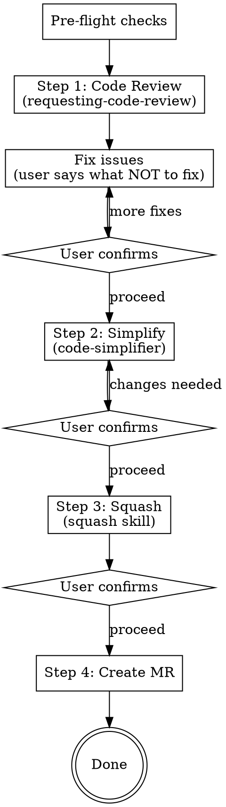

# Finalize Branch

## Overview

Gated workflow that chains four post-implementation steps: code review, simplify, squash, and MR creation. Each step presents output for user approval before proceeding.

**Core principle:** Review it, clean it, squash it, ship it.

**Announce at start:** "I'm using the finalize-branch skill to review, simplify, squash, and create an MR for this branch."

## Config

This skill reads optional config from `~/.config/ai-skills/config.env`. Source it at the start of every run, then reference the variables below. If the file is missing, the defaults are used.

```bash
[ -f ~/.config/ai-skills/config.env ] && source ~/.config/ai-skills/config.env
```

| Variable | Default | Purpose |
|---|---|---|
| `AI_SKILLS_MR_TOOL` | `gh` | `gh` (GitHub) or `glab` (GitLab) |
| `AI_SKILLS_REVIEWERS` | _(empty)_ | Comma-separated reviewer handles. Empty → no `--reviewer` flag |
| `AI_SKILLS_TARGET_BRANCH` | `main` | Target branch for the MR/PR |
| `AI_SKILLS_TICKET_PREFIX` | _(empty)_ | Ticket prefix (e.g. `PROJ`). Empty → match any uppercase slug |

## Pre-flight Checks

Before starting, verify all three conditions. Stop if any fails.

```bash
# 1. Not on main
[ "$(git branch --show-current)" = "main" ] && echo "STOP: on main" && exit 1

# 2. Clean working tree
git status --porcelain | grep -q . && echo "STOP: uncommitted changes" && exit 1

# 3. Has commits ahead of main
git fetch origin main --quiet
MERGE_BASE=$(git merge-base origin/main HEAD)
[ "$(git rev-parse HEAD)" = "$MERGE_BASE" ] && echo "STOP: no commits ahead of main" && exit 1
```

## The Process



### Step 1: Code Review

**REQUIRED SUB-SKILL:** Use `superpowers:requesting-code-review` if available; otherwise dispatch a code-reviewer subagent directly.

Compute SHAs using the merge-base (never `origin/main` directly):

```bash
git fetch origin main --quiet
BASE_SHA=$(git merge-base origin/main HEAD)
HEAD_SHA=$(git rev-parse HEAD)
```

Dispatch the code-reviewer subagent with these SHAs.

**After review returns:**

1. Present all findings to the user
2. **Default: fix everything.** The user will tell you what NOT to fix.
3. Fix the issues, commit the fixes
4. **GATE:** Ask the user to confirm before proceeding to Step 2

### Step 2: Simplify

**REQUIRED SUB-SKILL:** Use `simplify` (code-simplifier agent) if available.

The code-simplifier analyzes recently modified code on the branch and proposes clarity/consistency improvements.

**After simplify returns:**

1. Present the proposed changes to the user
2. User approves or rejects individual changes
3. Commit approved changes
4. **GATE:** Ask the user to confirm before proceeding to Step 3

### Step 3: Squash

**REQUIRED SUB-SKILL:** Use `squash`

The squash skill has its own internal gates:
- Proposes commit grouping and waits for user confirmation
- Executes rebase
- Verifies no changes lost (before/after diff)

**After squash completes:**

1. **GATE:** Ask the user to confirm before proceeding to Step 4

### Step 4: Create MR

Push the branch and create the MR.

```bash
# Load config
[ -f ~/.config/ai-skills/config.env ] && source ~/.config/ai-skills/config.env
TOOL="${AI_SKILLS_MR_TOOL:-gh}"
TARGET="${AI_SKILLS_TARGET_BRANCH:-main}"

# Push branch
git push -u origin "$(git branch --show-current)"
```

**Generate MR content — no approval gate. The user has opted into auto-accept, so thoroughness replaces the gate.**

Before drafting, read the full scope of the branch so the title/description reflect *all* the changes, not just the last commit subject:

```bash
BASE_SHA=$(git merge-base "origin/$TARGET" HEAD)

# All commits on the branch with bodies
git log --reverse --format='%s%n%n%b' $BASE_SHA..HEAD

# File-level scope check — confirm the diff matches what the commits claim
git diff --stat $BASE_SHA..HEAD
```

**Extract ticket reference.** Check the branch name first, then commit subjects/bodies. Use the first match. Pattern: `${AI_SKILLS_TICKET_PREFIX:-[A-Z]+}-[0-9]+`.

```bash
PATTERN="${AI_SKILLS_TICKET_PREFIX:-[A-Z]+}-[0-9]+"
BRANCH=$(git branch --show-current)
TICKET=$(printf '%s\n' "$BRANCH" | grep -oE "$PATTERN" | head -1)
if [ -z "$TICKET" ]; then
  TICKET=$(git log --format='%s%n%b' $BASE_SHA..HEAD | grep -oE "$PATTERN" | head -1)
fi
echo "Ticket: ${TICKET:-<none>}"
```

If a ticket was found, include `Closes <TICKET>` as the first line of the description (above `## Summary`). If no ticket was found, omit the line entirely — do not invent one and do not leave a placeholder.

Draft:
- **Title** (under 70 chars): describe the most significant outcome of the branch, not just the first commit subject. If the branch does one thing, name that thing. If it does several, name the theme.
- **Description:**
  - `Closes <TICKET>` — only when a ticket reference was found.
  - `## Summary` — bullets explaining WHAT changed and WHY. Use as many bullets as needed; every meaningful change on the branch should be represented.
  - `## Test plan` — bullets covering how to verify the change.

Announce the chosen title and description in your response (so the user sees what was decided), then create the MR in the same turn without waiting.

**Required flags on every MR created by this skill:**
- Draft marker — via the tool's draft flag (the boolean), **not** by prefixing `Draft:`/`WIP:` to the title.
- Reviewers — from `$AI_SKILLS_REVIEWERS` if set; omit `--reviewer` entirely if empty.
- Assignee — `@me`. Both `gh` and `glab` resolve this to the authenticated user.

**Tool-specific invocation** — `gh` and `glab` differ on flag names. Pick the block matching `$TOOL`:

```bash
# Build the reviewer flag only when AI_SKILLS_REVIEWERS is non-empty
REVIEWER_FLAG=""
[ -n "${AI_SKILLS_REVIEWERS:-}" ] && REVIEWER_FLAG="--reviewer $AI_SKILLS_REVIEWERS"

if [ "$TOOL" = "glab" ]; then
  glab mr create \
    --title "$TITLE" \
    --description "$DESCRIPTION" \
    --target-branch "$TARGET" \
    --draft \
    --assignee @me \
    $REVIEWER_FLAG
else
  gh pr create \
    --title "$TITLE" \
    --body "$DESCRIPTION" \
    --base "$TARGET" \
    --draft \
    --assignee @me \
    $REVIEWER_FLAG
fi
```

Where `$DESCRIPTION` is the heredoc-built body:

```bash
DESCRIPTION="$(cat <<EOF
${TICKET:+Closes $TICKET

}## Summary
<bullet points>

## Test plan
<verification steps>
EOF
)"
```

Return the MR/PR URL when done.

## Red Flags

**Never:**
- Skip a gate between Steps 1–3 — every one needs user confirmation
- Assume review findings should be ignored — fix all by default
- Force-push without the squash skill's verification passing
- Prefix the MR/PR title with `Draft:` or `WIP:` — use the tool's draft flag instead
- Draft MR title/description from the last commit subject alone — read the full branch scope first
- Invent or hallucinate a ticket number — only include `Closes <TICKET>` if the reference actually appears in the branch name or commits
- Leave a literal `<TICKET>` placeholder in the description — strip the line entirely when no ticket is found

**Always:**
- Source `~/.config/ai-skills/config.env` before Step 4 so reviewer/ticket/tool variables are populated
- Compute BASE_SHA as merge-base, never use the remote target branch directly
- Commit fixes from each step before proceeding to the next
- Use the tool from `$AI_SKILLS_MR_TOOL` (default `gh`) for MR/PR creation
- Run lint and format before any commits (project-specific; if your project has them, run them)
- Read `git log` and `git diff --stat` over `BASE_SHA..HEAD` before drafting MR title/description — thoroughness replaces the removed approval gate
- Pass `--draft` and `--assignee @me` on every invocation
- Only add `--reviewer` when `$AI_SKILLS_REVIEWERS` is non-empty
- Extract a ticket reference before drafting; if one exists, prepend `Closes <TICKET>` as the first line of the description

## Integration

**Pairs with:**
- **superpowers:executing-plans** — invoke this skill after plan execution completes
- **superpowers:requesting-code-review** — Step 1 sub-skill
- **simplify** (code-simplifier) — Step 2 sub-skill
- **squash** — Step 3 sub-skill
