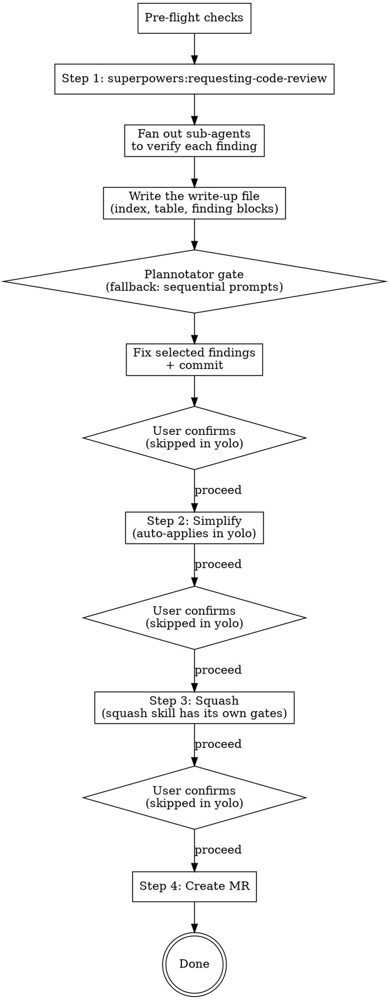

# Finalize Branch

## Overview

Workflow that chains four post-implementation steps: code review, simplify, squash, and MR creation.

**Core principle:** Review it, clean it, squash it, ship it.

**Announce at start:** "I'm using the finalize-branch skill to review, simplify, squash, and create an MR for this branch." If yolo mode is active, add: "Running in **yolo** mode — auto-applying simplify and squash without confirmation gates. Code-review findings will still be curated by you."

## Arguments

The skill accepts one optional argument that comes through as the literal text after `/finalize-branch`.

| Arg | Effect |
|---|---|
| _(none)_ | **Gated mode** (default). User confirms between Steps 1→2, 2→3, 3→4. |
| `yolo` (also accepts `--yolo`, `auto`, `-y`) | **Yolo mode.** Gates between Steps 2→3→4 are removed. Step 1 keeps finding curation (that's selection, not gating). |

Detect by matching the args case-insensitively against `^(yolo|--yolo|auto|-y)$`. If anything else is passed, ask the user what they meant rather than guessing.

**What yolo does NOT change:**
- Pre-flight checks still run and still stop the workflow on failure.
- Step 1's verification fan-out and finding curation still run — the write-up opens in the plannotator gate (numbered prompts when plannotator is absent) and the user picks which findings to address.
- The `squash` sub-skill has its own internal confirmation; we don't override that, surface it to the user as-is.
- The squash skill's diff-verification (no changes lost) still runs.

## Config

This skill reads optional config via the `AI_SKILLS_*` env vars. Recommended setup is one line in `~/.zshenv`:

```sh
[ -f ~/.config/ai-skills/config.env ] && source ~/.config/ai-skills/config.env
```

That makes the variables available to every shell Claude spawns. Commands below use `${VAR:-default}` syntax inline.

| Variable | Default | Purpose |
|---|---|---|
| `AI_SKILLS_MR_TOOL` | `gh` | `gh` (GitHub) or `glab` (GitLab) |
| `AI_SKILLS_REVIEWERS` | _(empty)_ | Comma-separated reviewer handles. Empty → no `--reviewer` flag |
| `AI_SKILLS_TARGET_BRANCH` | `main` | Target branch for the MR/PR |
| `AI_SKILLS_TICKET_PREFIX` | _(empty)_ | Ticket prefix (e.g. `PROJ`). Empty → match any uppercase slug |

## Pre-flight Checks

Before starting, verify all three conditions. Stop if any fails.

```bash
TARGET="${AI_SKILLS_TARGET_BRANCH:-main}"

# 1. Not on the target branch
[ "$(git branch --show-current)" = "$TARGET" ] && echo "STOP: on $TARGET" && exit 1

# 2. Clean working tree
git status --porcelain | grep -q . && echo "STOP: uncommitted changes" && exit 1

# 3. Has commits ahead of the target branch
git fetch origin "$TARGET" --quiet
MERGE_BASE=$(git merge-base "origin/$TARGET" HEAD)
[ "$(git rev-parse HEAD)" = "$MERGE_BASE" ] && echo "STOP: no commits ahead of $TARGET" && exit 1
```

## The Process



### Step 1: Code Review (with verification + curation)

This step is identical in both gated and yolo modes — the plannotator gate *is* the confirmation.

**REQUIRED SUB-SKILL:** Use `superpowers:requesting-code-review` to generate findings — it dispatches one reviewer sub-agent over the git range and returns a prose review (Strengths / Critical / Important / Minor / Assessment) that step 1a converts into the structured findings list.

Compute SHAs using the merge-base against the target branch (never the remote branch directly):

```bash
git fetch origin "${AI_SKILLS_TARGET_BRANCH:-main}" --quiet
BASE_SHA=$(git merge-base "origin/${AI_SKILLS_TARGET_BRANCH:-main}" HEAD)
HEAD_SHA=$(git rev-parse HEAD)
```

Invoke `superpowers:requesting-code-review` with these SHAs, filling its reviewer
template: `DESCRIPTION` = what this branch built (derive it from `git log` over the
range), `PLAN_OR_REQUIREMENTS` = the plan file or ticket if one exists, otherwise
say so explicitly rather than inventing requirements.

**1a. Structure the findings.** The reviewer returns prose, not a schema — convert
its `Issues` sections into the list below. Map its severity headings onto this
skill's scale: `Critical` → `critical` (or `high` when it is a bug without data
loss / security impact), `Important` → `medium` (or `high` when it breaks a
user-visible path), `Minor` → `low`, and pure style remarks → `nit`. Ignore
`Strengths`, `Recommendations`, and `Assessment` — this step consumes findings
only; the assessment verdict is not a gate.

Capture each finding as:

```
{
  "id": "F1",
  "severity": "critical|high|medium|low|nit",
  "file": "path/to/file.py",
  "line_start": 42,
  "line_end": 42,
  "title": "short headline",
  "issue": "what the reviewer says is wrong",
  "recommendation": "what the reviewer suggests"
}
```

If line numbers aren't provided, leave them null and treat the finding as file-level. Do not invent line numbers — wrong anchors mislead the user later.

**1b. Fan out to verify each finding in parallel.** Single message, one sub-agent per finding (use the `general-purpose` Agent type, `model: sonnet` — verification is a bounded read-and-judge task that runs cheaper/faster on Sonnet 5; the reviewer stays on the session model for recall). Each sub-agent gets:

```
Verify this code-review finding against the actual code on the current branch.

Finding:
  File: <file>
  Lines: <line_start>-<line_end>  (or "file-level")
  Issue: <issue text>
  Recommendation: <recommendation text>

Tasks:
  1. Read the cited file and surrounding context. Confirm whether the described
     issue is actually present at the cited location on the current branch. If
     the lines have shifted, find the equivalent location.
  2. Independently judge whether the recommendation, if applied, would actually
     resolve the issue without introducing a new problem.

Report:
  - issue_real: yes / no / partial — with one-sentence reason
  - fix_sound:  yes / no / risky   — with one-sentence reason
  - corrected_lines: <if the line numbers were wrong, give the right ones>
  - notes: anything else worth knowing

Be specific. Do not parrot the finding back — actually look at the code. Under 150 words.
```

Aggregate the results into a table keyed by finding id.

**1c. Write the findings up, then hand them to the user.** Before any decision is
taken, the user must be able to read what each finding *is*, what the *suggested
fix* is, and what verification concluded.

**Classify first (see 1d).** Sort every finding into exactly one bucket — Recommended
or Optional — *before* you write the document: the bucket sets each block's
`**Default:**`, and the block can't be written without it. The bucket rules live in
step 1d below (the bucket table), even though the gate-decision handling shares that step.

**Where it goes.** Always a file, never the terminal — regardless of finding count.
Resolve `GITDIR="$(git rev-parse --absolute-git-dir)"` and
`SLUG="$(git rev-parse --abbrev-ref HEAD | tr '/' '-')"`, then write the whole
write-up to `$GITDIR/review-$SLUG.md`. Inside the git dir the file is never
committed, never appears in `git status`, and is isolated per worktree — no
`.gitignore` edit needed, in any repo.

The file must stand alone. Content, in this order:

1. **The meta block** — branch, commit range, file/line counts, and the ticket
   reference when the branch or its commits carry one.
2. **A one-line count by severity**, then the `dropped, and why` line naming every
   verified false positive (`issue_real == no`) and its reason in a few words. These
   are not decision options; they are listed so the user knows they were considered.
3. **The overview table** — the *scan layer*, and the file's index. It comes here,
   before the detail it indexes, because a file is read from the top. The `ID` cell
   links to the finding's anchor.

   ```
   | ID | Sev | Anchor | Real? | Fix sound? | Bucket |
   |----|-----|--------|-------|------------|--------|
   | [F1](#f1--duplicate-afdeling-enum) | medium | services.py:120 | ✓ yes | ✓ yes | Recommended |
   | [F2](#f2--stale-cache-key) | low | (file-level) | ✓ yes | ⚠ risky | Optional |
   ```

   The `ID` anchors assume GitHub-style heading slugs (lowercase, em-dash dropped
   leaving a double hyphen, spaces → hyphens). If plannotator's renderer slugifies
   differently the links just don't jump — navigation only, never content — and the
   block sits right under the table regardless.

4. **Cluster sections and finding blocks** — the *detail layer*. Full rules in
   [Finding write-up format](#finding-write-up-format).

**What the terminal gets.** The absolute write-up path on its own line, and a one-line
count by severity. Nothing else — no write-ups, no excerpts, no table, no "highlights".
The table is in the document, and the document is what is being opened.

**Hand it over.** Open the write-up in the annotation UI and block on it. The command
re-derives the path itself — a separate `bash` block does not inherit `$GITDIR`/`$SLUG`
from the resolve above (only files cross blocks), so inline the substitutions:

```bash
command -v plannotator >/dev/null &&
plannotator annotate "$(git rev-parse --absolute-git-dir)/review-$(git rev-parse --abbrev-ref HEAD | tr '/' '-').md" --gate --json
```

`--gate` adds the Approve button; `--json` emits the decision on stdout. The call
blocks until the user approves, annotates, or closes the window — which is what makes
it a read gate: it cannot return before the user has been in the document.

**Approve discards annotations.** Clicking Approve emits a bare `approved` payload;
if the user annotated blocks first, plannotator drops those annotations before the
skill ever sees them. So a user who has marked up any block must submit via the
annotation flow, not Approve — Approve is for "every default stands, untouched." Say
this when you hand the write-up over.

**1d. Read the gate's decision.** Classify every shown finding into exactly one bucket
*before* writing the document — the bucket is what sets each block's `**Default:**`:

| Bucket | Rule | Default |
|---|---|---|
| **Recommended** | `issue_real ∈ {yes, partial}` AND `fix_sound != no` AND severity ∈ {`critical`, `high`, `medium`} | `take` |
| **Optional** | shown but not recommended: `low`/`nit` severity, or `fix_sound == risky` (real but the fix has caveats) | `skip` |

> **Precedence:** the rules overlap for a `medium`+ finding with `fix_sound == risky` — the
> risky clause wins and the finding goes to **Optional**, regardless of severity. A fix with
> caveats should not be auto-recommended; the user opts in deliberately.

> **Why `partial` counts as real.** A `partial` verdict usually means the *bug* is real but
> the reviewer's diagnosis of *how* it triggers was wrong. Fix the corrected version from the
> verification report, not the original claim.

Verified false positives (`issue_real == no`) never get a `**Default:**` line at all — they
are named in the `dropped, and why` line and are not part of the decision surface.

Then act on what `--json` returned:

| Decision | Meaning | What you do |
|---|---|---|
| `approved` | Approve was clicked | Every `**Default:**` stands. Apply. |
| `dismissed` | The window was closed without approving | **Abort.** Nothing is fixed, committed, or pushed. Say so and stop. |
| `annotated` | Annotations came back | Each annotation overrides the `**Default:**` of the finding whose block it anchors to. Unannotated findings keep theirs. |
| anything else | An unrecognised or unparseable payload | **Abort**, exactly as `dismissed`. Print what came back and stop. Never fall through to applying the defaults — an unreadable answer is not an affirmative one. |

Mapping rules for `annotated`:

- Annotations anchor per block — plannotator's annotatable nodes are paragraphs, headings
  and list items — so the finding's `###` heading is the intended target. Map an annotation
  to a finding by the `F<n>` token in its anchor text or its body.
- The vocabulary is `take`, `skip`, `fold into F<n>`, matched **case-insensitively**. `fold into F<n>` means the edit is
  covered by F*n*: do not apply it separately, and record it as folded rather than skipped.
- An annotation whose text is **not** in that vocabulary — a question, "explain more",
  "wrong line range" — applies **nothing** for that finding. Answer it, then re-open the
  write-up.
- If an annotation cannot be mapped to exactly one finding, **ask**. Never guess, and never
  quietly fall back to the default for it.

**Print an applied/skipped/folded receipt** naming every finding and the decision used,
before doing any work. That receipt is the user's only view of what the gate concluded.

**Silence is never consent.** The only thing that applies the defaults is an affirmative
payload — `approved`, or `annotated`, where each annotation overrides its own block and the
rest keep their defaults. Every other answer aborts: `dismissed` (which plannotator signals as
`{"decision": "dismissed"}`, or as exit 0 with empty output), and any unrecognised or
unparseable payload. A failure that yields **no answer at all** is the different case — the
binary missing, the browser never opening, a non-zero exit with nothing on stdout, the process dying before it emits
JSON — and only that routes to `1d-fallback` below, where the user answers in the terminal
instead. **Abort when an answer came back and was not an approval; fall back only when no
answer could be obtained.**

**1d-fallback. No plannotator.** Guard the gate with `command -v plannotator`. Use this path when
the binary is absent, or when the invocation produces **no payload** — a launch failure, a missing
browser, a process that dies before emitting JSON. A non-zero exit that still carried a payload is
not a fallback case: read it through the decision table above, where anything unrecognised aborts.
When you take this path, do this instead:

1. Print the absolute file path, the severity count, the overview table and the
   `dropped, and why` line to the terminal. **Then END YOUR TURN** — a complete assistant
   message that asks nothing. A same-turn prompt means the user picks findings they never
   read; "before" means a turn boundary, not text order.
2. In a *later* turn, after the user has replied, send **two sequential plain-text prompts
   with numbered options** — **never `AskUserQuestion`**. Prompt 1 is the Recommended bucket
   only: state that the default is all of them and that the user replies with numbers to
   drop (or "go" / "none"), and **wait for the answer**. Prompt 2 is the Optional bucket
   only, with the opposite default — **nothing is fixed unless the user names numbers**.
   Skip Prompt 2 when the bucket is empty.
3. Keep each line minimal: `[F3 medium] services.py:120 — duplicate enum 'Afdeling'` plus a
   verification flag in parentheses where one applies. The detail is in the file.

```markdown
**Recommended — 3 findings.** Default is all of them. Reply with numbers to drop, or "go".

1. [F1 high] downloads.py:64 — IDOR on document download  (✓ verified)
2. [F3 medium] services.py:120 — duplicate 'Afdeling' enum  (⚠ lines shifted to 125–128)
3. [F5 medium] handlers.py:2455 — as_of not threaded  (✓ verified)
```

Numbered text has no 4-option ceiling, so a long bucket stays **one** prompt — don't
fragment it. Order by severity inside each prompt. Never mix buckets.
**Silence is not an answer** — if no reply comes, stop rather than applying the default.

**1e. Fix the selected findings, commit.** Skip any the user did not select. Commit with a message that names what was fixed (e.g. `fix: close idor on document download, dedupe afdeling enum`) — never session-local finding ids (`F1`, `F3`), which mean nothing in git history.

**1f. Gate transition:**
- **Gated mode:** Ask "Proceed to Step 2 (simplify)?" before continuing.
- **Yolo mode:** Skip the confirmation — proceed directly to Step 2 in the same turn.

### Step 2: Simplify

**REQUIRED SUB-SKILL:** Use `simplify` (code-simplifier agent) if available.

The code-simplifier analyzes recently modified code on the branch and proposes clarity/consistency improvements.

**Gated mode** (default):
1. Present the proposed changes to the user
2. User approves or rejects individual changes
3. Commit approved changes
4. **GATE:** Ask the user to confirm before proceeding to Step 3

**Yolo mode:**
1. Apply all proposed changes the code-simplifier returns. Trust the sub-skill's judgment.
2. Print a short summary of what was applied (file + one-line description per change) so the user can see what happened.
3. Commit with `refactor: simplify per code-simplifier`.
4. Proceed directly to Step 3 in the same turn — no confirmation.

### Step 3: Squash

**REQUIRED SUB-SKILL:** Use `squash`

The squash skill has its own internal gates that this skill does NOT override (its grouping confirmation and diff-verification are safety, not approval). Yolo mode does not silence them — if the user wants them silenced, that's a change to the `squash` skill itself.

**Gated mode** (default): after squash completes, **GATE:** Ask the user to confirm before proceeding to Step 4.

**Yolo mode:** after squash completes (including its own internal confirmation), proceed directly to Step 4 in the same turn — no extra confirmation.

### Step 4: Create MR

The same tool path serves GitHub and GitLab — only the final create/update command differs
on `${AI_SKILLS_MR_TOOL:-gh}`.

**State across blocks.** Each fenced `bash` block below is a **separate Bash invocation** —
shell variables do not survive between them, only files do. Two values cannot be re-derived
later (`$UPSTREAM_SHA` must be read *before* 4a's fetch; `$TARGET` may have been settled by
the user), so 4a writes them to a state file and every later block re-sources it:

```bash
STATE="${MR_STATE:-$(git rev-parse --git-path mr-state.sh)}"
```

`$STATE` is not itself carried state — it is a constant expression, re-derived identically in
every block, landing under the current worktree's git directory (`git rev-parse --git-path`
resolves to `<main-repo>/.git/worktrees/<name>/mr-state.sh` in a linked worktree). Never
shared `/tmp`: two concurrent worktrees would collide on one file. 4a truncates it (`: >`) so
a file left behind by an earlier run can never leak into this one. Values are appended with
`printf '%q'` so spaces and shell metacharacters survive the round trip.

**4a. Target branch.** Never assume `main`. Branches are frequently stacked on an epic
branch, and retargeting a stacked branch at `main` proposes merging unreviewed upstream work.

```bash
STATE="${MR_STATE:-$(git rev-parse --git-path mr-state.sh)}"
: > "$STATE"

BRANCH=$(git branch --show-current)

# Captured BEFORE the fetch below — this is the value the force-push lease in 4e pins
# against. Empty when the branch has no upstream yet.
UPSTREAM_SHA=$(git rev-parse "@{u}" 2>/dev/null || true)

printf 'BRANCH=%q\n' "$BRANCH" >> "$STATE"
printf 'UPSTREAM_SHA=%q\n' "$UPSTREAM_SHA" >> "$STATE"

TARGET_DEFAULT="${AI_SKILLS_TARGET_BRANCH:-main}"
git fetch origin --quiet

BEST=""; BEST_N=""
for REF in $(git for-each-ref --format='%(refname:short)' refs/remotes/origin \
             | grep -v -E "^origin/HEAD$|^origin$|^origin/${BRANCH}$"); do
  MB=$(git merge-base "$REF" HEAD 2>/dev/null) || continue
  # Skip refs that already contain HEAD — their merge-base IS HEAD, scoring a false 0.
  [ "$MB" = "$(git rev-parse HEAD)" ] && continue
  N=$(git rev-list --count "$MB..HEAD")
  # On a tie, prefer the configured default over an arbitrary sibling branch.
  if [ -z "$BEST_N" ] || [ "$N" -lt "$BEST_N" ] \
     || { [ "$N" -eq "$BEST_N" ] && [ "$REF" = "origin/$TARGET_DEFAULT" ]; }; then
    BEST_N=$N; BEST=$REF
  fi
done
echo "configured default: origin/$TARGET_DEFAULT"
echo "nearest by divergence: $BEST ($BEST_N commits since its merge-base)"
```

"Nearest" is the candidate with the **fewest** commits HEAD has accumulated *since diverging
from it* — not the fewest commits contained by it: `--merged HEAD` containment breaks the
moment the default branch's tip stops being an ancestor of HEAD (it advances past the fork
point on almost every branch that isn't freshly forked), silently handing the win to whatever
merged-in sibling branch happens to still be an ancestor.

- Nearest equals the configured default (or the loop found no candidate) → use the default,
  say nothing.
- Nearest differs → **stop and ask the user** which branch to target, quoting both candidates
  and their commit counts. Do not push and do not create anything until they answer. This is
  a gate in yolo mode too — yolo removes the confirmations *between* steps, not a genuine
  ambiguity about where the work gets merged.

Then record the decision. `$TARGET` is the branch name **without** the `origin/` prefix; it is
consumed as `origin/$TARGET`:

```bash
STATE="${MR_STATE:-$(git rev-parse --git-path mr-state.sh)}"

# The settled branch name: the default when it won, the user's answer when they were asked.
TARGET="<settled branch name, no origin/ prefix>"
printf 'TARGET=%q\n' "$TARGET" >> "$STATE"
```

**4b. Ticket** — before drafting, since the ticket (if any) is the body's first line:

```bash
STATE="${MR_STATE:-$(git rev-parse --git-path mr-state.sh)}"
. "$STATE"

BASE_SHA=$(git merge-base "origin/$TARGET" HEAD)
PATTERN="${AI_SKILLS_TICKET_PREFIX:-[A-Z]+}-[0-9]+"
TICKET=$(printf '%s\n' "$BRANCH" | grep -oE "$PATTERN" | head -1)
if [ -z "$TICKET" ]; then
  TICKET=$(git log --format='%s%n%b' $BASE_SHA..HEAD | grep -oE "$PATTERN" | head -1)
fi
echo "Ticket: ${TICKET:-<none>}"

printf 'BASE_SHA=%q\n' "$BASE_SHA" >> "$STATE"
printf 'TICKET=%q\n' "${TICKET:-}" >> "$STATE"
```

Merge-base, never `origin/$TARGET` directly — the remote can be ahead of the fork point,
which pulls unrelated upstream commits into the diff you are describing.

If a tracker MCP is available (ClickUp/Jira/Linear), fetch the ticket and read it **for
intent only** — what problem was being solved. Do not copy its wording into `## Why`;
summarise the outcome. If the lookup fails, derive `Why` from the diff and commit messages,
and say so in your final report.

`Closes <TICKET>` goes first — keyword, space, ticket id, nothing else on the line.
Downstream automation parses it to transition the ticket, so a reworded or reformatted line
silently strands it. Omit the line entirely when no ticket reference exists.

**4c. Draft.** Re-read the diff you are describing (`git diff $BASE_SHA..HEAD`) and write
from it, not from what you remember implementing — a description written from session
memory narrates the journey, which no reviewer asked for. Write the title and body to files under the current
worktree's git directory, not shared `/tmp`: `git rev-parse --git-path` is worktree-aware, so
two concurrent worktrees never collide on the same path, and the location sits outside the
working tree so it never shows up in `git status --porcelain`.

```bash
TITLE_FILE="${MR_TITLE_FILE:-$(git rev-parse --git-path mr-title.txt)}"
BODY_FILE="${MR_BODY_FILE:-$(git rev-parse --git-path mr-body.md)}"
```

Both are constant expressions like `$STATE` — re-derive them in each block that needs them
rather than persisting the paths, so the step that writes a file and the steps that read it
cannot drift apart.

The body starts with the `Closes $TICKET` line when `$TICKET` is non-empty. Announce the
chosen title and the drafted body in your response before creating the MR, so the user sees
what was decided. If the environment mandates a scratchpad directory instead, set
`MR_TITLE_FILE` / `MR_BODY_FILE` (or assign the variables directly) to a path inside it.

Check for `.gitlab/merge_request_templates/` (or `.github/pull_request_template.md`) and
follow it when one exists.

**4d. The deletion pass.** Check every bullet against the diff: **if a reviewer would already
know it from the file list or the code itself, cut it.**

**4e. Push, then create or update.**

```bash
STATE="${MR_STATE:-$(git rev-parse --git-path mr-state.sh)}"
. "$STATE"

if [ -z "${UPSTREAM_SHA:-}" ]; then
  # No upstream existed at 4a — nothing to protect, a first push cannot clobber.
  git push -u origin "$BRANCH"
else
  git push -u origin "$BRANCH" \
    || git push --force-with-lease="refs/heads/$BRANCH:$UPSTREAM_SHA" -u origin "$BRANCH"
fi
```

The plain `git push` gets rejected as non-fast-forward whenever Step 3's squash rewrote
history that was already pushed. The retry pins `--force-with-lease` to `$UPSTREAM_SHA` — the
upstream tip captured in **4a, before the fetch**. An unpinned `--force-with-lease` re-reads
the remote-tracking ref at push time, and 4a's `git fetch origin` already refreshed that ref
to match whatever is on the remote right now — including a teammate's commit pushed in
between — so the lease would authorise the exact overwrite it exists to prevent. Pinning to
the pre-fetch SHA is what makes the lease reject a push when the remote moved out from under
this branch.

Then, on **`gh`**:

```bash
STATE="${MR_STATE:-$(git rev-parse --git-path mr-state.sh)}"
. "$STATE"
TITLE_FILE="${MR_TITLE_FILE:-$(git rev-parse --git-path mr-title.txt)}"
BODY_FILE="${MR_BODY_FILE:-$(git rev-parse --git-path mr-body.md)}"

REVIEWER_FLAG=()
[ -n "${AI_SKILLS_REVIEWERS:-}" ] && REVIEWER_FLAG=(--reviewer "$AI_SKILLS_REVIEWERS")

gh pr create \
  --title "$(cat "$TITLE_FILE")" \
  --body "$(cat "$BODY_FILE")" \
  --base "$TARGET" \
  --draft \
  --assignee @me \
  "${REVIEWER_FLAG[@]}"
```

The reviewer flag must be an **array**, expanded as `"${REVIEWER_FLAG[@]}"`. A plain string
expanded unquoted (`$REVIEWER_FLAG`) works only under bash: zsh does not word-split parameter
expansions, so the whole thing arrives as a single argv element and the tool reports an unknown
flag named `--reviewer handle1,handle2`. An empty array expands to zero arguments in both
shells, which is exactly what the no-reviewers case needs.

On **`glab`**, an MR may already exist on this source branch — and several can share one, in
which case `glab mr view` errors on the ambiguity. Resolve it explicitly:

```bash
STATE="${MR_STATE:-$(git rev-parse --git-path mr-state.sh)}"
. "$STATE"

OPEN=$(glab api "projects/:id/merge_requests?source_branch=$BRANCH&state=opened" \
  | python3 -c "import json,sys; print(' '.join(str(m['iid']) for m in json.load(sys.stdin)))")
echo "open MRs on $BRANCH: ${OPEN:-none}"
```

- **None** → create:

  ```bash
  STATE="${MR_STATE:-$(git rev-parse --git-path mr-state.sh)}"
  . "$STATE"
  TITLE_FILE="${MR_TITLE_FILE:-$(git rev-parse --git-path mr-title.txt)}"
  BODY_FILE="${MR_BODY_FILE:-$(git rev-parse --git-path mr-body.md)}"

  REVIEWER_FLAG=()
  [ -n "${AI_SKILLS_REVIEWERS:-}" ] && REVIEWER_FLAG=(--reviewer "$AI_SKILLS_REVIEWERS")

  glab mr create \
    --title "$(cat "$TITLE_FILE")" \
    --description "$(cat "$BODY_FILE")" \
    --target-branch "$TARGET" \
    --draft \
    --assignee @me \
    "${REVIEWER_FLAG[@]}" \
    --yes
  ```

  `glab` has no `--description-file`, hence the command substitution.

- **Exactly one** → update it in place, including the target branch, so a stale MR never
  points at the wrong one. Pass the IID you just read from the `$OPEN` output above as a
  literal — it does not survive into this block:

  ```bash
  STATE="${MR_STATE:-$(git rev-parse --git-path mr-state.sh)}"
  . "$STATE"
  TITLE_FILE="${MR_TITLE_FILE:-$(git rev-parse --git-path mr-title.txt)}"
  BODY_FILE="${MR_BODY_FILE:-$(git rev-parse --git-path mr-body.md)}"

  glab mr update <IID> \
    --description "$(cat "$BODY_FILE")" \
    --title "$(cat "$TITLE_FILE")" \
    --target-branch "$TARGET"
  ```

- **Two or more** → **stop.** Update nothing; ask the user which IID to target, listing the
  ones found.

**Clean up** once the URL is in hand — the state file has served its purpose and a stale one
is only a hazard for the next run:

```bash
rm -f "${MR_STATE:-$(git rev-parse --git-path mr-state.sh)}"
```

Return the MR/PR URL when done.

## Red Flags

**Never:**
- Skip the Step 1 curation gate — even in yolo mode, the user decides which findings get fixed. Yolo only skips gates *between* steps, not within Step 1.
- Use `AskUserQuestion` for anything — the between-step gates, and curation on the fallback path, are plain text with numbered options. The tool runs a countdown and assumes a default when it expires; "which findings do I fix" and "may I force-push" must not be answerable by a timer.
- Ask in the **same turn** as the 1c presentation **on the fallback path** — there the report must end its own turn and the user must reply before the first curation prompt. On the primary path the blocking gate carries that guarantee instead.
- Repeat finding detail (issue text, suggested fix) in the fallback prompt lines — the detail belongs in the 1c write-ups, which the user is reading in the write-up file. Lines stay minimal (ID + severity + anchor + headline + verification flag).
- Combine Recommended and Optional into one list **on the fallback path** — there they are sequential prompts (Recommended first, wait, then Optional) with opposite defaults. In the write-up they coexist, each block carrying its own `**Default:**`.
- Treat silence as an answer — no reply means stop, not "apply the default".
- Skip a gate between Steps 1–3 **in gated mode** — every one needs user confirmation in default mode
- Treat anything other than the documented yolo aliases (`yolo`, `--yolo`, `auto`, `-y`) as yolo — ask the user instead of guessing
- Skip the verification fan-out — bucket classification is only trustworthy if sub-agents have confirmed each one
- Apply unverified code-simplifier suggestions in yolo without printing a summary the user can scan
- Force-push without the squash skill's verification passing
- Prefix the MR/PR title with `Draft:` or `WIP:` — use the `--draft` flag
- Drop `--draft` or `--assignee @me` from the create command — both go on every invocation
- Invent or hallucinate a ticket number — only include `Closes <TICKET>` if the reference actually appears in the branch name or commits
- Leave a literal `<TICKET>` placeholder in the description
- Narrate the implementation you just did — the body is derived from the diff, the commits and the ticket, never from session memory
- Add a dedicated test-plan/QA-steps section (or any reviewer QA script) to an MR body — the reviewer reads the diff and CI, and did not ask for a QA script
- Retarget a stacked branch at `main` because the divergence check was skipped — 4a's ambiguity gate holds in yolo mode too
- Force-push with an unpinned `--force-with-lease` — 4a's fetch makes it authorise the very overwrite it exists to prevent
- Build the reviewer flag as a string and expand it unquoted (`$REVIEWER_FLAG`) — that is a bash-only idiom; zsh passes it as one argv element and the create fails on an unknown flag. Use an array plus `"${REVIEWER_FLAG[@]}"`

**Always:**
- Detect the yolo argument before starting — announce it explicitly so the user can interrupt if they didn't mean it
- Compute BASE_SHA as merge-base, never use the remote target branch directly
- Dispatch finding-verification sub-agents in parallel (single message, many tool calls)
- Write per-finding prose write-ups (metadata line / Problem. / Why it bites. / Fix. / My read. / Default., `---` separated) under an overview table that comes **first** — see [Finding write-up format](#finding-write-up-format)
- Curate through the plannotator gate (`plannotator annotate "$(git rev-parse --absolute-git-dir)/review-<branch>.md" --gate --json`, path re-derived inline so a separate `bash` block can't lose `$GITDIR`/`$SLUG`): `approved` applies every `**Default:**`, `dismissed` aborts, `annotated` overrides per finding, anything unrecognised aborts. Fall back to the two sequential numbered text prompts only when `command -v plannotator` fails or the gate produces no payload
- Always write the write-up to `$(git rev-parse --absolute-git-dir)/review-<branch>.md`, whatever the finding count — the terminal never carries the detail layer (Step 1c)
- Classify findings into Recommended (`issue_real ∈ {yes, partial}` AND `fix_sound != no` AND severity ∈ {critical, high, medium}) vs Optional (everything else shown); `fix_sound == risky` goes to Optional regardless of severity. The bucket sets each block's `**Default:**` — `take` for Recommended, `skip` for Optional
- Keep verified false positives (`issue_real == no`) off the decision surface — no `**Default:**` line, no fallback prompt line — and name them in the write-up's `dropped, and why` line
- Commit fixes from each step before proceeding to the next
- Use the tool from `$AI_SKILLS_MR_TOOL` (default `gh`) for MR/PR creation
- Run lint and format before any commits (project-specific; if your project has them, run them)
- Detect the target branch by divergence in Step 4a — never assume `${AI_SKILLS_TARGET_BRANCH:-main}`
- Pass `--draft` and `--assignee @me` on every invocation
- Only add `--reviewer` when `$AI_SKILLS_REVIEWERS` is non-empty
- Extract a ticket reference before drafting; if one exists, prepend a `Closes <TICKET>` first line

## Finding write-up format

The shape of the per-finding blocks in Step 1c — what the user reads in the write-up
file when curating.

```markdown
### F4 — applyAdjustFrame derefs state that can be nulled mid-POST
`medium` · `Recommended` · `floorplan-editor.js:1543` · verification **verified as claimed**

**Problem.** `applyAdjustFrame` awaits the POST at line 1508. `adjustMode` stays `true`
for that whole await, so anything that calls `cancelAdjust()` during it — Escape (2901),
`setDrawMode('pan')` (531), the page-change branch (1256) — runs `_exitAdjust()` and nulls
`adjustHandles`. Phase 2 then hits 1543 `adjustHandles.a.slice()` and throws. Pre-branch
that deref sat inside `if (frame)`; this branch hoisted it out.

**Why it bites.** The throw lands *after* the server persisted, so `loadDoors()` never
runs and the canvas shows pre-alignment geometry for data that is already saved. Nothing
catches it — the POST succeeded, so there is no failed request to notice.

**Fix.** Two edits in `floorplan-editor.js`:
- Snapshot both objects into locals before the Phase-1 await and use the snapshots in
  Phase 2: `const sentA = adjustHandles.a.slice(), sentB = adjustHandles.b.slice();`
- Reset `applyBtn.disabled = false` where the adjust toolbar is re-shown, so a session
  cancelled mid-flight doesn't leave the button dead.

**My read.** Take it — small, and it's a regression this branch introduced.

**Default:** take — annotate this block with `skip` to drop it, or `fold into F<n>`.

---
```

**Rules:**

- **The heading is `### F<n> — <headline>`.** ID plus headline, nothing else. It has to
  work as an editor outline entry, as a link target for the overview table, and as the
  block a decision annotation attaches to; a 120-character heading fails all three.
- **One metadata line directly under the heading**, `·`-separated, in this order:
  severity, bucket, anchor(s) as code spans, verification delta flag.
  - The **bucket** belongs here because the reader needs to know whether a finding is
    Recommended while reading it, not only when they reach the table.
  - **Anchors are code spans** (`` `services.py:120` ``) — that is the form editors and
    terminals will jump on. Chain them with `→` when the fix spans two places. A finding
    with no line to point at carries `(file-level)`, or the path it is about when one
    exists (`tests/integration/.../` for a missing module), matching what the overview
    table's Anchor column already does.
  - The **verification delta flag** is 2–4 words, rendered as
    `verification **<flag>**` — the label `verification` in plain text and the flag
    itself in bold, exactly as the worked example shows. The flag is typically one of: verified
    as claimed, corrected the remedy, inverted the diagnosis, widened the line range,
    downgraded to partial — write a 2–4 word flag of your own when none fits.
- **`**Problem.**` carries the mechanism only, capped at about 6 lines** — the trigger,
  the sequence, the resulting state. Cite `file:line` inline as you narrate rather than
  only in the header. Evidence that is not the mechanism belongs elsewhere: verbatim
  quotes and code go to `**Fix.**`, and provenance — "this branch hoisted it out", "the
  commit message names it and then does not touch it" — goes to `**My read.**`. A finding
  flagged `inverted the diagnosis` or `corrected the remedy` carries two mechanisms, the
  original claim and the correction, so about 8 lines is its honest ceiling; never buy the
  cap by dropping the correction, which the no-badge rule gives no other home.
- **`**Why it bites.**` is required and separate**: 1–2 sentences for the user-visible
  consequence and what fails to catch it. It exists so `**Problem.**` cannot sprawl. When
  a finding has no runtime consequence — a stale docstring, a vacuous test — it names who
  is misled and when instead. Never invent a runtime consequence to fill the line: a
  fabricated failure mode is worse than an honest "nothing breaks; the next person to read
  this is misled about X".
- **Run-on bold lead-ins**, terminated with a period, prose continuing on the same line.
  Never `**Issue:** <one line>`.
- **`**Fix.**` must be actionable, not a restatement of the problem.** Bullet per edit
  when there is more than one; inline the real code line, the real helper name, the real
  fixture that already exists. Say when it's a pure test addition with no production
  change.
- **No `**Verification:**` badge line.** Verification results get *woven into* the prose
  as corrections in your own voice — "Important correction to the original
  recommendation: `target_document_version_id` is the row's string id, while
  `get_page_sizes` needs the int `version` field", "Verification downgraded this to
  partial: nothing is locked at that point, so it's transaction duration, not lock
  contention". The metadata line's delta flag is an *index* into that prose, not a
  substitute for it: it carries no reasoning and no evidence. Full verdicts stay in the
  overview table.
- **`**My read.**` is one sentence** — take it / skip it / fold into F*n* — and only when
  the call isn't obvious from the block. It takes a second sentence only when something
  changes how the finding is *handled* rather than whether it is right: a finding outside
  the diff's hunks that cannot be anchored to a line, or one whose scope is wider than
  this branch.
- **`**Default:**` is the last line of every block**, before the separator. It states the
  disposition that applies if the user says nothing, and names the words that override
  it. Recommended → `take`; Optional → `skip`. This is what the curation gate reads.
- **`---` between every finding.** Including two consecutive findings inside the same
  cluster. The separator is what makes a long list navigable.
- **Clustering is encouraged** when findings share one mechanism: give the cluster a
  `## Cluster A — <the mechanism>` heading and a one-line note on how the findings
  interact (e.g. "F1's write-back closes F6; F2's narrowing is what makes it legible").
  Each finding inside still gets its own full block, its own metadata line, its own
  `**Default:**` and its own `---` — a cluster heading is not a licence to merge
  findings into one paragraph.
- **The overview table comes first**, not last — before the cluster sections, after the
  count and dropped lines. It covers every finding including clustered ones.

## Integration

**Pairs with:**
- **superpowers:executing-plans** — invoke this skill after plan execution completes
- **superpowers:requesting-code-review** — Step 1 finder (dispatches the reviewer sub-agent)
- **simplify** (code-simplifier) — Step 2 sub-skill
- **squash** — Step 3 sub-skill
