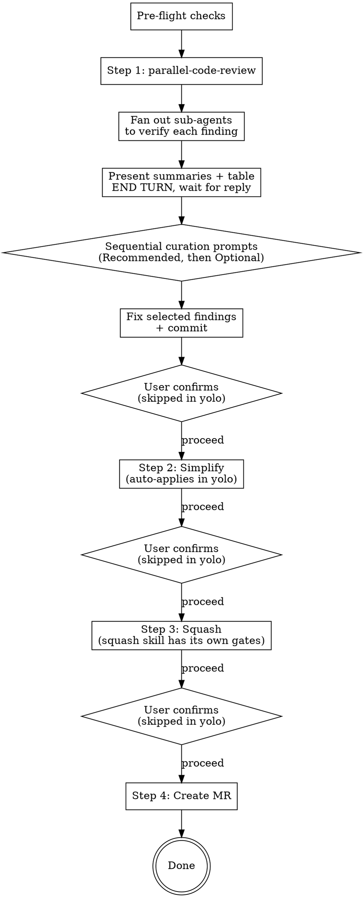

# Finalize Branch

## Overview

Workflow that chains four post-implementation steps: code review, simplify, squash, and MR creation.

**Core principle:** Review it, clean it, squash it, ship it.

**Announce at start:** "I'm using the finalize-branch skill to review, simplify, squash, and create an MR for this branch." If yolo mode is active, add: "Running in **yolo** mode — auto-applying simplify and squash without confirmation gates. Code-review findings will still be curated by you."

## Arguments

The skill accepts one optional argument that comes through as the literal text after `/finalize-branch`.

| Arg | Effect |
|---|---|
| _(none)_ | **Gated mode** (default). User confirms between Steps 1→2, 2→3, 3→4. |
| `yolo` (also accepts `--yolo`, `auto`, `-y`) | **Yolo mode.** Gates between Steps 2→3→4 are removed. Step 1 keeps the curation checklist (that's selection, not gating). |

Detect by matching the args case-insensitively against `^(yolo|--yolo|auto|-y)$`. If anything else is passed, ask the user what they meant rather than guessing.

**What yolo does NOT change:**
- Pre-flight checks still run and still stop the workflow on failure.
- Step 1's presentation + curation prompts (verification fan-out, then Recommended/Optional prompts) still run — the user picks which findings to address.
- The `squash` sub-skill has its own internal confirmation; we don't override that, surface it to the user as-is.
- The squash skill's diff-verification (no changes lost) still runs.

## Config

This skill reads optional config via the `AI_SKILLS_*` env vars. Recommended setup is one line in `~/.zshenv`:

```sh
[ -f ~/.config/ai-skills/config.env ] && source ~/.config/ai-skills/config.env
```

That makes the variables available to every shell Claude spawns. Commands below use `${VAR:-default}` syntax inline.

| Variable | Default | Purpose |
|---|---|---|
| `AI_SKILLS_MR_TOOL` | `gh` | `gh` (GitHub) or `glab` (GitLab) |
| `AI_SKILLS_REVIEWERS` | _(empty)_ | Comma-separated reviewer handles. Empty → no `--reviewer` flag |
| `AI_SKILLS_TARGET_BRANCH` | `main` | Target branch for the MR/PR |
| `AI_SKILLS_TICKET_PREFIX` | _(empty)_ | Ticket prefix (e.g. `PROJ`). Empty → match any uppercase slug |

## Pre-flight Checks

Before starting, verify all three conditions. Stop if any fails.

```bash
TARGET="${AI_SKILLS_TARGET_BRANCH:-main}"

# 1. Not on the target branch
[ "$(git branch --show-current)" = "$TARGET" ] && echo "STOP: on $TARGET" && exit 1

# 2. Clean working tree
git status --porcelain | grep -q . && echo "STOP: uncommitted changes" && exit 1

# 3. Has commits ahead of the target branch
git fetch origin "$TARGET" --quiet
MERGE_BASE=$(git merge-base "origin/$TARGET" HEAD)
[ "$(git rev-parse HEAD)" = "$MERGE_BASE" ] && echo "STOP: no commits ahead of $TARGET" && exit 1
```

## The Process



### Step 1: Code Review (with verification + curation)

This step is identical in both gated and yolo modes — the curation prompts *are* the gate.

**REQUIRED SUB-SKILL:** Use `parallel-code-review` to generate findings — it fans out 5 dimension-specialist reviewers and returns the deduped findings list this step consumes. (Falls back to `superpowers:requesting-code-review` only if `parallel-code-review` is unavailable.)

Compute SHAs using the merge-base against the target branch (never the remote branch directly):

```bash
git fetch origin "${AI_SKILLS_TARGET_BRANCH:-main}" --quiet
BASE_SHA=$(git merge-base "origin/${AI_SKILLS_TARGET_BRANCH:-main}" HEAD)
HEAD_SHA=$(git rev-parse HEAD)
```

Invoke `parallel-code-review` with these SHAs.

**1a. Structure the findings.** Capture each finding as:

```
{
  "id": "F1",
  "severity": "critical|high|medium|low|nit",
  "file": "path/to/file.py",
  "line_start": 42,
  "line_end": 42,
  "title": "short headline",
  "issue": "what the reviewer says is wrong",
  "recommendation": "what the reviewer suggests"
}
```

If line numbers aren't provided, leave them null and treat the finding as file-level. Do not invent line numbers — wrong anchors mislead the user later.

**1b. Fan out to verify each finding in parallel.** Single message, one sub-agent per finding (use the `general-purpose` Agent type). Each sub-agent gets:

```
Verify this code-review finding against the actual code on the current branch.

Finding:
  File: <file>
  Lines: <line_start>-<line_end>  (or "file-level")
  Issue: <issue text>
  Recommendation: <recommendation text>

Tasks:
  1. Read the cited file and surrounding context. Confirm whether the described
     issue is actually present at the cited location on the current branch. If
     the lines have shifted, find the equivalent location.
  2. Independently judge whether the recommendation, if applied, would actually
     resolve the issue without introducing a new problem.

Report:
  - issue_real: yes / no / partial — with one-sentence reason
  - fix_sound:  yes / no / risky   — with one-sentence reason
  - corrected_lines: <if the line numbers were wrong, give the right ones>
  - notes: anything else worth knowing

Be specific. Do not parrot the finding back — actually look at the code. Under 150 words.
```

Aggregate the results into a table keyed by finding id.

**1c. Present the findings — then END YOUR TURN.** Before any `AskUserQuestion`, the user must be able to read what each finding *is*, what the *suggested fix* is, and what verification concluded. Print, in this order:

1. **A short summary of each finding** — one block per finding. This is the *detail layer*; the checkbox options later stay minimal because the detail already lives here.

   ```
   ### F1 — [medium] services.py:120 — duplicate enum 'Afdeling'
   **Issue:** <2–4 sentences: what's wrong and why it matters>
   **Suggested fix:** <the recommendation, made concrete — the actual change to apply>
   **Verification:** ✓ issue real, fix sound   (or ⚠ lines shifted to 125–128 / ⚠ fix risky: <one-line caveat> / ⚠ partial — corrected diagnosis: <…>)
   ```

2. **An overview table at the end** — the *scan layer* the user reads right before deciding:

   ```
   | ID | Sev | Anchor | Real? | Fix sound? | Bucket |
   |----|-----|--------|-------|------------|--------|
   | F1 | medium | services.py:120 | ✓ yes | ✓ yes | Recommended |
   | F2 | low | (file-level) | ✓ yes | ⚠ risky | Optional |
   ```

**Then END YOUR TURN.** The presentation must be a complete assistant message with **no `AskUserQuestion` in the same turn** — the dialog seizes screen focus the moment it fires, so a same-turn prompt buries the analysis and the user picks findings they never read. Putting the report "before" the prompt *within one turn* does **not** satisfy this. Wait for the user's reply (a "go", a question about a finding, or a re-classification) and only then send the curation prompts in 1d.

**Excluded findings** (`issue_real == no` — verified false positives) are **not** shown as options. List them in a brief "dropped, and why" line inside the presentation so the user knows they were considered.

**1d. Curation prompts** (in the turn *after* the user replies to 1c). Classify each shown finding into one bucket, then run **sequential** `AskUserQuestion` calls with `multiSelect: true` — never one combined dialog:

| Bucket | Rule | Prompt |
|---|---|---|
| **Recommended** | `issue_real ∈ {yes, partial}` AND `fix_sound != no` AND severity ∈ {`critical`, `high`, `medium`} | Prompt 1 |
| **Optional** | shown but not recommended: `low`/`nit` severity, or `fix_sound == risky` (real but the fix has caveats) | Prompt 2 |

> **Precedence:** the rules overlap for a `medium`+ finding with `fix_sound == risky` — the risky clause wins and the finding goes to **Optional**, regardless of severity. A fix with caveats should not be auto-recommended; the user opts in with the caveat visible in the badge.

> **Why `partial` counts as real.** A `partial` verdict usually means the *bug* is real but the reviewer's diagnosis of *how* it triggers was wrong. Fix the corrected version from the verification report, not the original claim.

- **Prompt 1** — only the Recommended bucket. Question text makes clear every option is skill-recommended; user unticks to drop. **Wait for the answer before Prompt 2.**
- **Prompt 2** — only the Optional bucket. Empty selection is the expected default; user ticks to opt in. Skip this prompt if the bucket is empty.

**Keep option labels minimal** — the detail already appeared in 1c. Label: `[F3 medium] services.py:120 — duplicate enum 'Afdeling'` (ID + severity + anchor + headline). The `description` field carries **only** the verification badge (`✓ verified, fix sound`, `⚠ lines shifted to 125–128`) — no summary sentences.

If a bucket exceeds 4 options, batch within the bucket across consecutive prompts (4 per call), grouped by severity so heavy hitters come first. Never mix buckets in one prompt; finish all Recommended prompts before the first Optional one.

**1e. Fix the selected findings, commit.** Skip any the user did not select. Commit with a message that names what was fixed (e.g. `fix: close idor on document download, dedupe afdeling enum`) — never session-local finding ids (`F1`, `F3`), which mean nothing in git history.

**1f. Gate transition:**
- **Gated mode:** Ask "Proceed to Step 2 (simplify)?" before continuing.
- **Yolo mode:** Skip the confirmation — proceed directly to Step 2 in the same turn.

### Step 2: Simplify

**REQUIRED SUB-SKILL:** Use `simplify` (code-simplifier agent) if available.

The code-simplifier analyzes recently modified code on the branch and proposes clarity/consistency improvements.

**Gated mode** (default):
1. Present the proposed changes to the user
2. User approves or rejects individual changes
3. Commit approved changes
4. **GATE:** Ask the user to confirm before proceeding to Step 3

**Yolo mode:**
1. Apply all proposed changes the code-simplifier returns. Trust the sub-skill's judgment.
2. Print a short summary of what was applied (file + one-line description per change) so the user can see what happened.
3. Commit with `refactor: simplify per code-simplifier`.
4. Proceed directly to Step 3 in the same turn — no confirmation.

### Step 3: Squash

**REQUIRED SUB-SKILL:** Use `squash`

The squash skill has its own internal gates that this skill does NOT override (its grouping confirmation and diff-verification are safety, not approval). Yolo mode does not silence them — if the user wants them silenced, that's a change to the `squash` skill itself.

**Gated mode** (default): after squash completes, **GATE:** Ask the user to confirm before proceeding to Step 4.

**Yolo mode:** after squash completes (including its own internal confirmation), proceed directly to Step 4 in the same turn — no extra confirmation.

### Step 4: Create MR

Push the branch and create the MR.

```bash
git push -u origin "$(git branch --show-current)"
```

**Generate MR content — no separate content-approval gate.** The transition into this step was already confirmed (the Step 3→4 gate in gated mode, the yolo opt-in otherwise), so thoroughness replaces a content gate.

Before drafting, read the full scope of the branch so the title/description reflect *all* the changes, not just the last commit subject:

```bash
BASE_SHA=$(git merge-base "origin/${AI_SKILLS_TARGET_BRANCH:-main}" HEAD)

# All commits on the branch with bodies
git log --reverse --format='%s%n%n%b' $BASE_SHA..HEAD

# File-level scope check — confirm the diff matches what the commits claim
git diff --stat $BASE_SHA..HEAD
```

**Extract ticket reference.** Check the branch name first, then commit subjects/bodies. Use the first match. Pattern: `${AI_SKILLS_TICKET_PREFIX:-[A-Z]+}-[0-9]+`.

```bash
PATTERN="${AI_SKILLS_TICKET_PREFIX:-[A-Z]+}-[0-9]+"
BRANCH=$(git branch --show-current)
TICKET=$(printf '%s\n' "$BRANCH" | grep -oE "$PATTERN" | head -1)
if [ -z "$TICKET" ]; then
  TICKET=$(git log --format='%s%n%b' $BASE_SHA..HEAD | grep -oE "$PATTERN" | head -1)
fi
echo "Ticket: ${TICKET:-<none>}"
```

If a ticket was found, include `Closes <TICKET>` as the first line of the description (above `## Summary`). If no ticket was found, omit the line entirely — do not invent one and do not leave a placeholder.

Draft:
- **Title** (under 70 chars): describe the most significant outcome of the branch, not just the first commit subject. If the branch does one thing, name that thing. If it does several, name the theme.
- **Description:**
  - `Closes <TICKET>` — only when a ticket reference was found.
  - `## Summary` — bullets explaining WHAT changed and WHY. Use as many bullets as needed; every meaningful change on the branch should be represented.
  - `## Test plan` — bullets covering how to verify the change.

Announce the chosen title and description in your response (so the user sees what was decided), then create the MR in the same turn without waiting.

**Required flags on every MR created by this skill:**
- Draft marker — via the tool's draft flag (the boolean), **not** by prefixing `Draft:`/`WIP:` to the title.
- Reviewers — from `$AI_SKILLS_REVIEWERS` if set; omit `--reviewer` entirely if empty.
- Assignee — `@me`. Both `gh` and `glab` resolve this to the authenticated user.

**Tool-specific invocation** — `gh` and `glab` differ on flag names. Pick the block matching `$AI_SKILLS_MR_TOOL` (default `gh`):

```bash
# Build the reviewer flag only when AI_SKILLS_REVIEWERS is non-empty
REVIEWER_FLAG=""
[ -n "${AI_SKILLS_REVIEWERS:-}" ] && REVIEWER_FLAG="--reviewer $AI_SKILLS_REVIEWERS"

if [ "${AI_SKILLS_MR_TOOL:-gh}" = "glab" ]; then
  glab mr create \
    --title "$TITLE" \
    --description "$DESCRIPTION" \
    --target-branch "${AI_SKILLS_TARGET_BRANCH:-main}" \
    --draft \
    --assignee @me \
    $REVIEWER_FLAG
else
  gh pr create \
    --title "$TITLE" \
    --body "$DESCRIPTION" \
    --base "${AI_SKILLS_TARGET_BRANCH:-main}" \
    --draft \
    --assignee @me \
    $REVIEWER_FLAG
fi
```

Where `$DESCRIPTION` is the heredoc-built body:

```bash
DESCRIPTION="$(cat <<EOF
${TICKET:+Closes $TICKET

}## Summary
<bullet points>

## Test plan
<verification steps>
EOF
)"
```

Return the MR/PR URL when done.

## Red Flags

**Never:**
- Skip the Step 1 curation prompts — even in yolo mode, the user selects which findings to fix. Yolo only skips gates *between* steps, not within Step 1.
- Fire an `AskUserQuestion` in the **same turn** as the 1c presentation — the report must end its own turn and the user must reply before the first curation prompt. Same-turn text-then-dialog buries the analysis under the dialog.
- Cram finding detail (issue text, suggested fix) into `AskUserQuestion` option `description` fields — descriptions truncate and the detail belongs in the 1c summaries. Options stay minimal (ID + severity + anchor + headline + verification badge).
- Combine Recommended and Optional into one dialog — they are sequential prompts (Recommended first, wait, then Optional).
- Skip a gate between Steps 1–3 **in gated mode** — every one needs user confirmation in default mode
- Treat anything other than the documented yolo aliases (`yolo`, `--yolo`, `auto`, `-y`) as yolo — ask the user instead of guessing
- Skip the verification fan-out — bucket classification is only trustworthy if sub-agents have confirmed each one
- Apply unverified code-simplifier suggestions in yolo without printing a summary the user can scan
- Force-push without the squash skill's verification passing
- Prefix the MR/PR title with `Draft:` or `WIP:` — use the tool's draft flag instead
- Draft MR title/description from the last commit subject alone — read the full branch scope first
- Invent or hallucinate a ticket number — only include `Closes <TICKET>` if the reference actually appears in the branch name or commits
- Leave a literal `<TICKET>` placeholder in the description — strip the line entirely when no ticket is found

**Always:**
- Detect the yolo argument before starting — announce it explicitly so the user can interrupt if they didn't mean it
- Compute BASE_SHA as merge-base, never use the remote target branch directly
- Dispatch finding-verification sub-agents in parallel (single message, many tool calls)
- Present per-finding summaries (Issue / Suggested fix / Verification) + an overview table in a turn that **ends**, before any curation prompt
- Classify findings into Recommended (`issue_real ∈ {yes, partial}` AND `fix_sound != no` AND severity ∈ {critical, high, medium}) vs Optional (everything else shown); `fix_sound == risky` goes to Optional regardless of severity; run them as two sequential prompts
- Drop verified false positives (`issue_real == no`) from the prompts and list them briefly in the 1c presentation
- Commit fixes from each step before proceeding to the next
- Use the tool from `$AI_SKILLS_MR_TOOL` (default `gh`) for MR/PR creation
- Run lint and format before any commits (project-specific; if your project has them, run them)
- Read `git log` and `git diff --stat` over `BASE_SHA..HEAD` before drafting MR title/description — thoroughness replaces the removed approval gate
- Pass `--draft` and `--assignee @me` on every invocation
- Only add `--reviewer` when `$AI_SKILLS_REVIEWERS` is non-empty
- Extract a ticket reference before drafting; if one exists, prepend `Closes <TICKET>` as the first line of the description

## Integration

**Pairs with:**
- **superpowers:executing-plans** — invoke this skill after plan execution completes
- **parallel-code-review** — Step 1 finder (fans out specialist reviewers)
- **superpowers:requesting-code-review** — fallback finder if parallel-code-review is unavailable
- **simplify** (code-simplifier) — Step 2 sub-skill
- **squash** — Step 3 sub-skill
