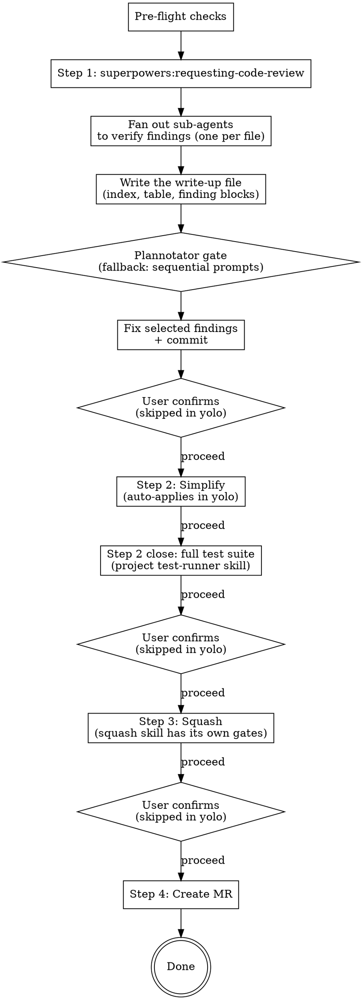

# Finalize Branch

## Overview

Chains four post-implementation steps: code review, simplify, squash, MR creation. Review it, clean it, squash it, ship it.

**Announce at start:** "I'm using the finalize-branch skill to review, simplify, squash, and create an MR for this branch." In yolo mode add: "Running in **yolo** mode — auto-applying simplify and squash without confirmation gates. Code-review findings will still be curated by you."

## Arguments

One optional argument — the literal text after `/finalize-branch`.

| Arg | Effect |
|---|---|
| _(none)_ | **Gated mode** (default). User confirms between Steps 1→2, 2→3, 3→4. |
| `yolo` (also `--yolo`, `auto`, `-y`) | **Yolo mode.** Gates between Steps 2→3→4 are removed. Step 1 keeps finding curation — that's selection, not gating. |

Match case-insensitively against `^(yolo|--yolo|auto|-y)$`. Anything else → ask what was meant.

**Yolo does not change:** pre-flight checks; Step 1's verification fan-out and curation gate; the `squash` sub-skill's own confirmation and diff-verification.

## Config

Optional `AI_SKILLS_*` env vars; recommended setup is one line in `~/.zshenv`:

```sh
[ -f ~/.config/ai-skills/config.env ] && source ~/.config/ai-skills/config.env
```

Commands below use `${VAR:-default}` inline.

| Variable | Default | Purpose |
|---|---|---|
| `AI_SKILLS_MR_TOOL` | `gh` | `gh` (GitHub) or `glab` (GitLab) |
| `AI_SKILLS_REVIEWERS` | _(empty)_ | Comma-separated reviewer handles. Empty → no `--reviewer` flag |
| `AI_SKILLS_TARGET_BRANCH` | `main` | Target branch for the MR/PR |
| `AI_SKILLS_TICKET_PREFIX` | _(empty)_ | Ticket prefix (e.g. `PROJ`). Empty → match any uppercase slug |

## Pre-flight Checks

All three must pass; stop otherwise.

```bash
TARGET="${AI_SKILLS_TARGET_BRANCH:-main}"

# 1. Not on the target branch
[ "$(git branch --show-current)" = "$TARGET" ] && echo "STOP: on $TARGET" && exit 1

# 2. Clean working tree
git status --porcelain | grep -q . && echo "STOP: uncommitted changes" && exit 1

# 3. Has commits ahead of the target branch
git fetch origin "$TARGET" --quiet
MERGE_BASE=$(git merge-base "origin/$TARGET" HEAD)
[ "$(git rev-parse HEAD)" = "$MERGE_BASE" ] && echo "STOP: no commits ahead of $TARGET" && exit 1
```

## The Process



### Step 1: Code Review (with verification + curation)

Identical in both modes — the plannotator gate *is* the confirmation.

**REQUIRED SUB-SKILL:** `superpowers:requesting-code-review` — dispatches one reviewer sub-agent over the git range and returns a prose review (Strengths / Critical / Important / Minor / Assessment).

SHAs from the merge-base, never the remote branch directly:

```bash
git fetch origin "${AI_SKILLS_TARGET_BRANCH:-main}" --quiet
BASE_SHA=$(git merge-base "origin/${AI_SKILLS_TARGET_BRANCH:-main}" HEAD)
HEAD_SHA=$(git rev-parse HEAD)
```

Reviewer template: `DESCRIPTION` = what the branch built (from `git log` over the range); `PLAN_OR_REQUIREMENTS` = the plan file or ticket if one exists, otherwise say so rather than inventing requirements.

**1a. Structure the findings.** Convert the reviewer's `Issues` into the list below. Severity mapping: `Critical` → `critical` (or `high` when no data-loss/security impact); `Important` → `medium` (or `high` when it breaks a user-visible path); `Minor` → `low`; style → `nit`. Ignore `Strengths`, `Recommendations`, `Assessment` — the verdict is not a gate.

```
{
  "id": "F1",
  "severity": "critical|high|medium|low|nit",
  "file": "path/to/file.py",
  "line_start": 42,
  "line_end": 42,
  "title": "short headline",
  "issue": "what the reviewer says is wrong",
  "recommendation": "what the reviewer suggests"
}
```

No line numbers → leave null, treat as file-level. Never invent them.

**1b. Group findings by file; one sub-agent per file, in parallel.** Single message, many tool calls; `general-purpose` type, `model: sonnet` — a bounded read-and-judge task; the reviewer stays on the session model for recall.

Per file, not per finding: it collapses redundant reads, and — more important — **a recommendation is often only wrong next to another finding on the same file.** One false positive can be exactly what makes a second finding's cheap remedy wrong. A per-finding agent can't see that; task 3 asks for it.

Findings with no `file` get one brief of their own. Cap a wave at ~8 sub-agents; more files → consecutive waves.

```
Verify these code-review findings against the actual code on the current branch.

File: <file>

Findings:
  [<id>] Lines: <line_start>-<line_end>  (or "file-level")
         Issue: <issue text>
         Recommendation: <recommendation text>
  [<id>] ... (repeat per finding on this file)

Tasks:
  1. Read the file and the surrounding context for every cited location before
     judging any of them. If the lines have shifted, find the equivalent location.
  2. For each finding: confirm whether the described issue is actually present at
     the cited location on the current branch, and independently judge whether the
     recommendation, if applied, would resolve it without introducing a new problem.
  3. Check the findings against each other. Say so explicitly if one being wrong, or
     one being applied, changes whether another is real or makes another's
     recommendation wrong — that interaction is invisible to anyone reading a single
     finding in isolation.

Report per finding id, under 150 words each:
  - issue_real: yes / no / partial — with one-sentence reason
  - fix_sound:  yes / no / risky   — with one-sentence reason
  - corrected_lines: <if the line numbers were wrong, give the right ones>
  - notes: anything else worth knowing, including any interaction found in task 3

Be specific. Do not parrot the findings back — actually look at the code.
```

Aggregate into a table keyed by finding id.

**1c. Write the findings up, then hand them over.** The user must be able to read what each finding *is*, the *suggested fix*, and what verification concluded before deciding anything.

**Classify first** (bucket table in 1d) — the bucket sets each block's `**Default:**`.

**Location.** Always a file. `GITDIR="$(git rev-parse --absolute-git-dir)"`, `SLUG="$(git rev-parse --abbrev-ref HEAD | tr '/' '-')"`, write to `$GITDIR/review-$SLUG.md` — never committed, invisible to `git status`, isolated per worktree, no `.gitignore` edit.

The file stands alone. In order:

1. **Meta block** — branch, commit range, file/line counts, ticket reference when the branch or commits carry one.
2. **One-line count by severity**, then the `dropped, and why` line naming every verified false positive (`issue_real == no`) with a few-word reason — not decision options, listed so the user knows they were considered.
3. **Overview table** — the scan layer and index. `ID` links to the finding's anchor.

   ```
   | ID | Sev | Anchor | Real? | Fix sound? | Bucket |
   |----|-----|--------|-------|------------|--------|
   | [F1](#f1--duplicate-afdeling-enum) | medium | services.py:120 | ✓ yes | ✓ yes | Recommended |
   | [F2](#f2--stale-cache-key) | low | (file-level) | ✓ yes | ⚠ risky | Optional |
   ```

   Anchors assume GitHub-style slugs (lowercase, em-dash → double hyphen, spaces → hyphens). If plannotator slugifies differently the links just don't jump — navigation only.

4. **Cluster sections and finding blocks** — see [Finding write-up format](#finding-write-up-format).

**Terminal gets** the absolute path on its own line and the severity count. Nothing else — no excerpts, no table, no "highlights".

**Hand it over.** A separate `bash` block doesn't inherit `$GITDIR`/`$SLUG`, so inline the substitutions:

```bash
command -v plannotator >/dev/null &&
plannotator annotate "$(git rev-parse --absolute-git-dir)/review-$(git rev-parse --abbrev-ref HEAD | tr '/' '-').md" --gate --json
```

`--gate` adds Approve; `--json` emits the decision on stdout. The call blocks until the user approves, annotates, or closes — it cannot return before they have been in the document. **Run it with `run_in_background: true`** and poll — the user may take hours, and a foreground call dies at the Bash tool's 10-minute cap.

**Approve discards annotations.** Approve emits a bare `approved` and drops any annotations made first. A user who has marked up a block must submit via the annotation flow. Say this when handing over.

**1d. Buckets and the gate's decision.** Exactly one bucket per shown finding, decided before the document is written:

| Bucket | Rule | Default |
|---|---|---|
| **Recommended** | `issue_real ∈ {yes, partial}` AND `fix_sound != no` AND (severity ∈ {`critical`, `high`, `medium`} OR `**My read.**` is take at `low`/`nit`) | `take` |
| **Optional** | shown but not recommended: `low`/`nit` with a `skip` read, or `fix_sound == risky` (real but the fix has caveats) | `skip` |

> **Precedence:** `medium`+ with `fix_sound == risky` → **Optional**. A caveated fix is not auto-recommended; the user opts in deliberately.

> **`partial` counts as real.** It usually means the bug is real but the reviewer's trigger diagnosis was wrong. Fix the corrected version from the verification report, not the original claim.

Verified false positives (`issue_real == no`) get no `**Default:**` line — they live in the `dropped, and why` line only.

Then act on `--json`:

| Decision | Meaning | What you do |
|---|---|---|
| `approved` | Approve clicked | Every `**Default:**` stands. Apply. |
| `dismissed` | Window closed without approving | **Abort.** Nothing fixed, committed, or pushed. Say so. |
| `annotated` | Annotations returned | Each overrides the `**Default:**` of the block it anchors to; the rest keep theirs. |
| anything else | Unrecognised / unparseable | **Abort** as `dismissed`. Print what came back. Never apply defaults on an unreadable answer. |

`annotated` mapping:

- Annotations anchor per block (paragraph, heading, list item); the `### F<n>` heading is the intended target. Map by the `F<n>` token in anchor text or body.
- Vocabulary: `take`, `skip`, `fold into F<n>` — case-insensitive. `fold into F<n>` = covered by F*n*; don't apply separately, record as folded.
- Text outside the vocabulary (a question, "wrong line range") applies **nothing**. Answer it, re-open the write-up.
- Can't map to exactly one finding → **ask**. Never guess, never fall back to the default.

**Print an applied/skipped/folded receipt** naming every finding before doing any work — the user's only view of what the gate concluded.

**Silence is never consent.** Only an affirmative payload applies defaults: `approved`, or `annotated`. `dismissed` (`{"decision": "dismissed"}`, or exit 0 with empty output) and any unrecognised payload abort. **No answer at all** — binary missing, browser never opened, non-zero exit with empty stdout, process died before emitting JSON — is the only case that routes to the fallback. *Abort when an answer came back and wasn't approval; fall back only when no answer could be obtained.*

**1d-fallback. No plannotator.** Guard with `command -v plannotator`. Take this path on absence or **no payload**; a non-zero exit that still carried a payload goes through the table above.

1. Print the absolute path, severity count, overview table and `dropped, and why` line. **Then END YOUR TURN** — a message that asks nothing. A same-turn prompt means the user picks findings they never read; "before" is a turn boundary, not text order.
2. In a *later* turn, two sequential numbered plain-text prompts — **never `AskUserQuestion`**. Prompt 1: Recommended only, default all, reply with numbers to drop (or "go" / "none"); **wait**. Prompt 2: Optional only, opposite default — nothing is fixed unless named; skip when empty.
3. One line per finding: `[F3 medium] services.py:120 — duplicate enum 'Afdeling'` plus a verification flag in parentheses where one applies. Detail is in the file.

```markdown
**Recommended — 3 findings.** Default is all of them. Reply with numbers to drop, or "go".

1. [F1 high] downloads.py:64 — IDOR on document download  (✓ verified)
2. [F3 medium] services.py:120 — duplicate 'Afdeling' enum  (⚠ lines shifted to 125–128)
3. [F5 medium] handlers.py:2455 — as_of not threaded  (✓ verified)
```

Numbered text has no 4-option ceiling — one prompt per bucket, never fragmented. Order by severity. Never mix buckets. No reply → stop; don't apply the default.

**1e. Fix the selected findings, commit.** Skip unselected ones. The message names what was fixed (`fix: close idor on document download, dedupe afdeling enum`) — never session-local ids (`F1`, `F3`).

**1f. Gate transition.** Gated: ask "Proceed to Step 2 (simplify)?". Yolo: proceed in the same turn.

### Step 2: Simplify

**REQUIRED SUB-SKILL:** `simplify` (code-simplifier agent) if available. It proposes clarity/consistency improvements on the branch's recently modified code.

**Gated:** present the proposals; the user approves or rejects each; commit the approved ones; **GATE** before Step 3.

**Yolo:** apply everything the simplifier returns; print a short summary (file + one line per change); commit `refactor: simplify per code-simplifier`; proceed to Step 3 in the same turn.

**Step 2 close — full test suite, once.** After the last Step 2 commit and before
the gate, run the project's full suite through its test-runner skill
(`pytest-docker` Tier 2 where that skill is installed; otherwise the project's
documented full-suite command). This is the branch's single local full-suite
run: implementers run only targeted tests, and nothing between tasks does, so
this is where a cross-cutting break surfaces before the MR round-trip. Fix
failures you caused, commit, re-run once; the squash in Step 3 folds the fix.
Pre-existing failures are reported, not fixed (the test-runner skill's
classification rules apply). In yolo the run still happens — only the gate is skipped.

### Step 3: Squash

**REQUIRED SUB-SKILL:** `squash`

Its internal gates (grouping confirmation, diff-verification) are safety, not approval — this skill never overrides them, yolo included. Silencing them is a change to `squash` itself.

**Gated:** after squash, **GATE** before Step 4. **Yolo:** after squash (including its own confirmation), proceed to Step 4 in the same turn.

### Step 4: Create MR

One path for GitHub and GitLab; only the final create/update command differs on `${AI_SKILLS_MR_TOOL:-gh}`.

**State across blocks.** Each fenced `bash` block is a separate Bash invocation — variables don't survive, files do. Two values can't be re-derived later (`$UPSTREAM_SHA` must be read *before* 4a's fetch; `$TARGET` may have been settled by the user), so 4a writes them to a state file every later block re-sources:

```bash
STATE="${MR_STATE:-$(git rev-parse --git-path mr-state.sh)}"
```

`$STATE` is a constant expression re-derived in every block, landing under the current worktree's git directory (`<main-repo>/.git/worktrees/<name>/mr-state.sh` in a linked worktree) — never shared `/tmp`, where concurrent worktrees would collide. 4a truncates it (`: >`) so a stale file can't leak into this run. Values are appended with `printf '%q'` so spaces and metacharacters survive.

**4a. Target branch.** Never assume `main`: branches are often stacked on an epic branch, and retargeting one at `main` proposes merging unreviewed upstream work.

```bash
STATE="${MR_STATE:-$(git rev-parse --git-path mr-state.sh)}"
: > "$STATE"

BRANCH=$(git branch --show-current)

# Captured BEFORE the fetch below — this is the value the force-push lease in 4e pins
# against. Empty when the branch has no upstream yet.
UPSTREAM_SHA=$(git rev-parse "@{u}" 2>/dev/null || true)

printf 'BRANCH=%q\n' "$BRANCH" >> "$STATE"
printf 'UPSTREAM_SHA=%q\n' "$UPSTREAM_SHA" >> "$STATE"

TARGET_DEFAULT="${AI_SKILLS_TARGET_BRANCH:-main}"
git fetch origin --quiet

BEST=""; BEST_N=""
for REF in $(git for-each-ref --format='%(refname:short)' refs/remotes/origin \
             | grep -v -E "^origin/HEAD$|^origin$|^origin/${BRANCH}$"); do
  MB=$(git merge-base "$REF" HEAD 2>/dev/null) || continue
  # Skip refs that already contain HEAD — their merge-base IS HEAD, scoring a false 0.
  [ "$MB" = "$(git rev-parse HEAD)" ] && continue
  N=$(git rev-list --count "$MB..HEAD")
  # On a tie, prefer the configured default over an arbitrary sibling branch.
  if [ -z "$BEST_N" ] || [ "$N" -lt "$BEST_N" ] \
     || { [ "$N" -eq "$BEST_N" ] && [ "$REF" = "origin/$TARGET_DEFAULT" ]; }; then
    BEST_N=$N; BEST=$REF
  fi
done
echo "configured default: origin/$TARGET_DEFAULT"
echo "nearest by divergence: $BEST ($BEST_N commits since its merge-base)"
```

"Nearest" = fewest commits HEAD has accumulated *since diverging* from the candidate — not `--merged HEAD` containment, which breaks as soon as the default branch's tip stops being an ancestor of HEAD (almost every branch that isn't freshly forked) and silently hands the win to a merged-in sibling.

- Nearest equals the default (or no candidate) → use the default, say nothing.
- Nearest differs → **stop and ask** which to target, quoting both candidates and counts. Push and create nothing until answered. **This gate holds in yolo too** — yolo removes confirmations *between* steps, not a genuine ambiguity about where the work merges.

Record the decision — the branch name **without** `origin/`, consumed as `origin/$TARGET`:

```bash
STATE="${MR_STATE:-$(git rev-parse --git-path mr-state.sh)}"

# The settled branch name: the default when it won, the user's answer when they were asked.
TARGET="<settled branch name, no origin/ prefix>"
printf 'TARGET=%q\n' "$TARGET" >> "$STATE"
```

**4b. Ticket** — before drafting; it is the body's first line:

```bash
STATE="${MR_STATE:-$(git rev-parse --git-path mr-state.sh)}"
. "$STATE"

BASE_SHA=$(git merge-base "origin/$TARGET" HEAD)
PATTERN="${AI_SKILLS_TICKET_PREFIX:-[A-Z]+}-[0-9]+"
TICKET=$(printf '%s\n' "$BRANCH" | grep -oE "$PATTERN" | head -1)
if [ -z "$TICKET" ]; then
  TICKET=$(git log --format='%s%n%b' $BASE_SHA..HEAD | grep -oE "$PATTERN" | head -1)
fi
echo "Ticket: ${TICKET:-<none>}"

printf 'BASE_SHA=%q\n' "$BASE_SHA" >> "$STATE"
printf 'TICKET=%q\n' "${TICKET:-}" >> "$STATE"
```

Merge-base, never `origin/$TARGET` directly — the remote can be ahead of the fork point and pull unrelated commits into the diff you describe.

With a tracker MCP (ClickUp/Jira/Linear), read the ticket **for intent only** — don't copy its wording into `## Why`; summarise the outcome. If lookup fails, derive `Why` from the diff and commits and say so.

`Closes <TICKET>` goes first — keyword, space, id, nothing else on the line. Automation parses it to transition the ticket; a reworded line silently strands it. Omit the line when there is no ticket.

**4c. Draft.** Re-read the diff (`git diff $BASE_SHA..HEAD`) and write from it, not from memory of implementing — session memory narrates the journey, which no reviewer asked for. Title and body go to files under the worktree's git directory, not shared `/tmp`:

```bash
TITLE_FILE="${MR_TITLE_FILE:-$(git rev-parse --git-path mr-title.txt)}"
BODY_FILE="${MR_BODY_FILE:-$(git rev-parse --git-path mr-body.md)}"
```

Constant expressions like `$STATE` — re-derive per block. Body starts with `Closes $TICKET` when set. Announce title and body in your response before creating. If the environment mandates a scratchpad, point `MR_TITLE_FILE` / `MR_BODY_FILE` inside it. Follow `.gitlab/merge_request_templates/` or `.github/pull_request_template.md` when present.

**4d. Deletion pass.** Check every bullet against the diff: **if a reviewer would already know it from the file list or the code, cut it.**

**4e. Push, then create or update.**

```bash
STATE="${MR_STATE:-$(git rev-parse --git-path mr-state.sh)}"
. "$STATE"

if [ -z "${UPSTREAM_SHA:-}" ]; then
  # No upstream existed at 4a — nothing to protect, a first push cannot clobber.
  git push -u origin "$BRANCH"
else
  git push -u origin "$BRANCH" \
    || git push --force-with-lease="refs/heads/$BRANCH:$UPSTREAM_SHA" -u origin "$BRANCH"
fi
```

Plain push is rejected as non-fast-forward when Step 3's squash rewrote pushed history. The retry pins `--force-with-lease` to `$UPSTREAM_SHA` from **4a, before the fetch**. An unpinned lease re-reads the remote-tracking ref, which 4a's `git fetch origin` already refreshed to whatever is on the remote now — a teammate's commit included — so it would authorise the exact overwrite it exists to prevent.

On **`gh`**:

```bash
STATE="${MR_STATE:-$(git rev-parse --git-path mr-state.sh)}"
. "$STATE"
TITLE_FILE="${MR_TITLE_FILE:-$(git rev-parse --git-path mr-title.txt)}"
BODY_FILE="${MR_BODY_FILE:-$(git rev-parse --git-path mr-body.md)}"

REVIEWER_FLAG=()
[ -n "${AI_SKILLS_REVIEWERS:-}" ] && REVIEWER_FLAG=(--reviewer "$AI_SKILLS_REVIEWERS")

gh pr create \
  --title "$(cat "$TITLE_FILE")" \
  --body "$(cat "$BODY_FILE")" \
  --base "$TARGET" \
  --draft \
  --assignee @me \
  "${REVIEWER_FLAG[@]}"
```

The reviewer flag is an **array** expanded as `"${REVIEWER_FLAG[@]}"`. An unquoted string (`$REVIEWER_FLAG`) works only in bash — zsh doesn't word-split, so the tool sees one argv element and reports an unknown flag `--reviewer handle1,handle2`. An empty array expands to nothing in both shells.

On **`glab`**, an MR may already exist on the branch — several can, and `glab mr view` errors on the ambiguity. Resolve explicitly:

```bash
STATE="${MR_STATE:-$(git rev-parse --git-path mr-state.sh)}"
. "$STATE"

OPEN=$(glab api "projects/:id/merge_requests?source_branch=$BRANCH&state=opened" \
  | python3 -c "import json,sys; print(' '.join(str(m['iid']) for m in json.load(sys.stdin)))")
echo "open MRs on $BRANCH: ${OPEN:-none}"
```

- **None** → create (`glab` has no `--description-file`, hence the substitution):

  ```bash
  STATE="${MR_STATE:-$(git rev-parse --git-path mr-state.sh)}"
  . "$STATE"
  TITLE_FILE="${MR_TITLE_FILE:-$(git rev-parse --git-path mr-title.txt)}"
  BODY_FILE="${MR_BODY_FILE:-$(git rev-parse --git-path mr-body.md)}"

  REVIEWER_FLAG=()
  [ -n "${AI_SKILLS_REVIEWERS:-}" ] && REVIEWER_FLAG=(--reviewer "$AI_SKILLS_REVIEWERS")

  glab mr create \
    --title "$(cat "$TITLE_FILE")" \
    --description "$(cat "$BODY_FILE")" \
    --target-branch "$TARGET" \
    --draft \
    --assignee @me \
    "${REVIEWER_FLAG[@]}" \
    --yes
  ```

- **Exactly one** → update in place, target branch included, so a stale MR never points at the wrong one. Pass the IID from `$OPEN` as a literal — it doesn't survive into this block:

  ```bash
  STATE="${MR_STATE:-$(git rev-parse --git-path mr-state.sh)}"
  . "$STATE"
  TITLE_FILE="${MR_TITLE_FILE:-$(git rev-parse --git-path mr-title.txt)}"
  BODY_FILE="${MR_BODY_FILE:-$(git rev-parse --git-path mr-body.md)}"

  glab mr update <IID> \
    --description "$(cat "$BODY_FILE")" \
    --title "$(cat "$TITLE_FILE")" \
    --target-branch "$TARGET"
  ```

- **Two or more** → **stop.** Update nothing; ask which IID, listing them.

**Clean up** once the URL is in hand — a stale state file is a hazard for the next run:

```bash
rm -f "${MR_STATE:-$(git rev-parse --git-path mr-state.sh)}"
```

Return the MR/PR URL.

## Red Flags

**Never:**
- Skip the Step 1 curation gate — yolo skips gates *between* steps, not within Step 1.
- Use `AskUserQuestion` — every gate and fallback prompt is plain text with numbered options. Its countdown assumes a default; "which findings do I fix" and "may I force-push" must not be answerable by a timer.
- Ask in the **same turn** as the 1c presentation **on the fallback path** — the report ends its own turn. On the primary path the blocking gate carries that guarantee.
- Repeat finding detail in fallback prompt lines — it's in the write-up. Lines stay ID + severity + anchor + headline + verification flag.
- Combine Recommended and Optional into one list **on the fallback path** — sequential prompts with opposite defaults. In the write-up they coexist, each block carrying its own `**Default:**`.
- Treat silence as an answer — no reply means stop.
- Skip a gate between Steps 1–3 **in gated mode**.
- Treat anything other than `yolo`, `--yolo`, `auto`, `-y` as yolo — ask.
- Skip the verification fan-out — buckets are only trustworthy once sub-agents have confirmed each finding.
- Apply code-simplifier suggestions in yolo without a summary the user can scan.
- Force-push without the squash skill's verification passing.
- Prefix the title with `Draft:` or `WIP:` — use `--draft`.
- Drop `--draft` or `--assignee @me` from the create command.
- Invent a ticket number — `Closes <TICKET>` only when the reference appears in the branch name or commits.
- Leave a literal `<TICKET>` placeholder in the description.
- Narrate the implementation — the body comes from the diff, commits and ticket, never session memory.
- Add a test-plan/QA-steps section to the body — the reviewer reads the diff and CI.
- Retarget a stacked branch at `main` because the divergence check was skipped — 4a's gate holds in yolo.
- Force-push with an unpinned `--force-with-lease` — 4a's fetch makes it authorise the overwrite it exists to prevent.
- Build the reviewer flag as a string expanded unquoted (`$REVIEWER_FLAG`) — bash-only; zsh passes one argv element. Use an array plus `"${REVIEWER_FLAG[@]}"`.

**Always:**
- Detect and announce the yolo argument before starting.
- Compute `BASE_SHA` as merge-base, never the remote target branch directly.
- Dispatch verification sub-agents in parallel (single message, many tool calls).
- Write per-finding prose blocks (metadata line / Problem. / Why it bites. / Fix. / My read. / Default., `---` separated) under an overview table that comes **first** — [Finding write-up format](#finding-write-up-format).
- Curate through the plannotator gate (`plannotator annotate "$(git rev-parse --absolute-git-dir)/review-<branch>.md" --gate --json`, path re-derived inline): `approved` applies every `**Default:**`, `dismissed` aborts, `annotated` overrides per finding, anything unrecognised aborts. Fall back to the two sequential numbered prompts only when `command -v plannotator` fails or the gate produces no payload.
- Write the write-up to `$(git rev-parse --absolute-git-dir)/review-<branch>.md`, whatever the count — the terminal never carries the detail layer.
- Classify Recommended (`issue_real ∈ {yes, partial}` AND `fix_sound != no` AND (severity ∈ {critical, high, medium} OR `**My read.**` is take at low/nit)) vs Optional (everything else shown); `fix_sound == risky` → Optional regardless of severity. Recommended → `take`, Optional → `skip`; `**My read.**` never contradicts `**Default:**`.
- Keep verified false positives (`issue_real == no`) off the decision surface — no `**Default:**`, no prompt line — and name them in `dropped, and why`.
- Commit each step's fixes before the next.
- Use `$AI_SKILLS_MR_TOOL` (default `gh`) for creation.
- Run lint and format before any commit (project-specific).
- Run the full test suite exactly once, at Step 2 close — never earlier in this skill, never again after squash.
- Detect the target branch by divergence in 4a — never assume `${AI_SKILLS_TARGET_BRANCH:-main}`.
- Pass `--draft` and `--assignee @me` on every invocation; add `--reviewer` only when `$AI_SKILLS_REVIEWERS` is non-empty.
- Extract a ticket before drafting; if one exists, prepend `Closes <TICKET>`.

## Finding write-up format

The per-finding blocks in the Step 1c write-up.

```markdown
### F4 — applyAdjustFrame derefs state that can be nulled mid-POST
`medium` · `Recommended` · `floorplan-editor.js:1543` · verification **verified as claimed**

**Problem.** `applyAdjustFrame` awaits the POST at line 1508. `adjustMode` stays `true`
for that whole await, so anything that calls `cancelAdjust()` during it — Escape (2901),
`setDrawMode('pan')` (531), the page-change branch (1256) — runs `_exitAdjust()` and nulls
`adjustHandles`. Phase 2 then hits 1543 `adjustHandles.a.slice()` and throws. Pre-branch
that deref sat inside `if (frame)`; this branch hoisted it out.

**Why it bites.** The throw lands *after* the server persisted, so `loadDoors()` never
runs and the canvas shows pre-alignment geometry for data that is already saved. Nothing
catches it — the POST succeeded, so there is no failed request to notice.

**Fix.** Two edits in `floorplan-editor.js`:
- Snapshot both objects into locals before the Phase-1 await and use the snapshots in
  Phase 2: `const sentA = adjustHandles.a.slice(), sentB = adjustHandles.b.slice();`
- Reset `applyBtn.disabled = false` where the adjust toolbar is re-shown, so a session
  cancelled mid-flight doesn't leave the button dead.

**My read.** Take it — small, and it's a regression this branch introduced.

**Default:** take — annotate this block with `skip` to drop it, or `fold into F<n>`.

---
```

**Rules:**

- **Heading: `### F<n> — <headline>`.** ID plus headline only — it is the outline entry, the table's link target, and the annotation anchor; a 120-character heading fails all three.
- **One metadata line under the heading**, `·`-separated, in order: severity, bucket, anchor(s) as code spans, verification delta flag.
  - Bucket is here because the reader needs it while reading, not only at the table.
  - Anchors are code spans (`` `services.py:120` ``); chain with `→` when the fix spans two places. No line → `(file-level)` or the path it concerns, matching the table's Anchor column.
  - Delta flag: 2–4 words as `verification **<flag>**` — label plain, flag bold. Typical: verified as claimed, corrected the remedy, inverted the diagnosis, widened the line range, downgraded to partial; coin one when none fits.
- **`**Problem.**` — mechanism only, ~6 lines**: trigger, sequence, resulting state, `file:line` cited inline. Quotes and code go to `**Fix.**`; provenance ("this branch hoisted it out") goes to `**My read.**`. `inverted the diagnosis` / `corrected the remedy` carry two mechanisms, so ~8 lines; never meet the cap by dropping the correction.
- **`**Why it bites.**` — required, separate**, 1–2 sentences: the user-visible consequence and what fails to catch it. No runtime consequence → name who is misled and when. Never invent a failure mode.
- **Run-on bold lead-ins** ending in a period, prose on the same line. Never `**Issue:** <one line>`.
- **`**Fix.**` is actionable** — bullet per edit when more than one; real code line, real helper, real fixture. Say when it's a pure test addition.
- **No `**Verification:**` badge line.** Corrections are woven into the prose in your own voice ("Important correction to the original recommendation: …", "Verification downgraded this to partial: …"). The delta flag indexes that prose; it carries no reasoning. Full verdicts live in the table.
- **`**My read.**` — one sentence**: take / skip / fold into F*n*, only when not obvious from the block. A second sentence only when it changes *handling* — outside the diff's hunks, or wider than this branch.
- **`**Default:**` is the last line** before the separator: the disposition that applies on silence and the words that override it. Recommended → `take`; Optional → `skip`. The gate reads this.
- **`**My read.**` and `**Default:**` agree** — take ⇔ Recommended. A `take` read at `low`/`nit` is the Recommended criterion for that severity (1d), so bucket it Recommended. A `take` read on a `risky` fix is the read being wrong — precedence keeps the bucket Optional, so the read becomes `skip` with the caveat named. When the two lines disagree at write time, one of them is wrong; fix it before the next block.
- **`---` between every finding**, including within a cluster.
- **Cluster when findings share a mechanism**: `## Cluster A — <the mechanism>` plus one line on how they interact ("F1's write-back closes F6"). Every finding inside keeps its full block, metadata line, `**Default:**` and `---`.
- **Overview table first** — after the counts and dropped line, before the clusters; it covers every finding.

## Integration

- **superpowers:executing-plans** — invoke this skill after plan execution completes
- **superpowers:requesting-code-review** — Step 1 finder
- **simplify** (code-simplifier) — Step 2
- **squash** — Step 3
