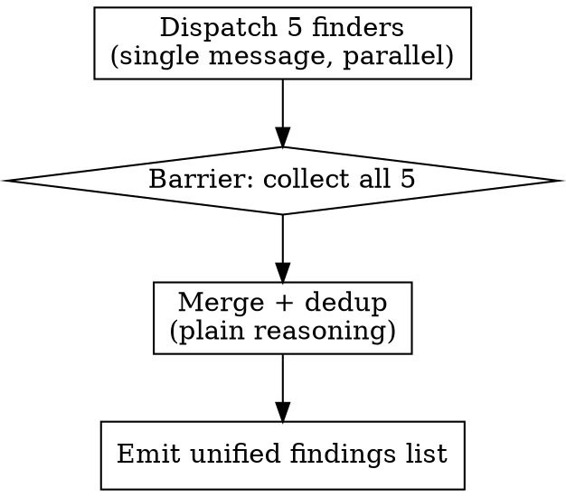

# parallel-code-review

A high-recall finder. Where a single reviewer surfaces the obvious few issues,
this fans out five specialist reviewers — each with its full attention on one
lane — then dedupes. It does **finding only**: verification, curation, and posting
stay with the caller (`finalize-branch`, `mr-review`, or you, ad-hoc).

**Core principle:** recall is set by the finder; precision is set by whoever
verifies afterward. This skill maximizes recall and hands a clean list onward.

**Announce at start:** "Using parallel-code-review to fan out specialist reviewers over the diff."

## Inputs

- `BASE_SHA`, `HEAD_SHA` — the git range. The **caller passes these in**; do not
  recompute them (finalize uses merge-base; mr-review also derives a separate
  GitLab position base — recomputing would fight both).
- **Standalone use:** if no caller supplied them, compute:
  ```bash
  git fetch origin main --quiet
  BASE_SHA=$(git merge-base origin/main HEAD)
  HEAD_SHA=$(git rev-parse HEAD)
  ```

## Output

A deduped findings list in this schema, produced **in your working context** (this
skill runs inline — it is not a returning subagent). The calling skill reads the
list for its next step.

```
{ id, severity, file, line_start, line_end, title, issue, recommendation, source }
```

Severity scale: `critical` / `high` / `medium` / `low` / `nit`.

## Process



### Step 1: Dispatch the 5 finders in ONE message

Read [references/specialist-briefs.md](references/specialist-briefs.md). Dispatch
**five `general-purpose` subagents in a single message** (parallel tool calls).
Each gets the shared preamble (with `BASE_SHA`/`HEAD_SHA` filled in) plus exactly
one lane brief: correctness, conventions, tests, security, architecture/performance.

Do not collapse lanes into fewer agents — the separation is what produces the
recall gain. Do not add chunking; each finder sees the whole diff once.

### Step 2: Collect (barrier)

Wait for all five. If a finder **fails or returns nothing parseable**, do not abort
the review — record `"<lane> finder failed — coverage incomplete"` and continue
with the survivors. Note it in the summary so the caller knows recall was reduced.

### Step 3: Merge + dedup (plain reasoning — no subagent)

Combine all findings, then dedupe:

- **Match key:** same `file` + overlapping line range (within ±3 lines) + the same
  underlying root issue. (Cross-lane dupes are expected — e.g. security and
  correctness flagging one line.)
- **On collision:** keep one finding; take the **highest** severity; **union** the
  `source` values (e.g. `["security","correctness"]`); merge recommendations if
  they differ.
- **Re-id** sequentially: `F1`, `F2`, … after dedup.
- **Never silently drop:** report the counts — e.g. `"14 raw findings → 10 after dedup"`.

### Step 4: Emit

Produce the deduped list (schema above) plus the one-line dedup/coverage summary.
Stop here — verification, curation, and any posting belong to the caller.

## Edge cases

- **Zero findings** (all finders clean): emit `[]` and say so. Valid outcome.
- **No rule files in repo:** the conventions finder returns `[]`. No error.
- **A finder dies:** continue with survivors; flag incomplete coverage.
- **Invented line numbers:** not this skill's problem to catch — the caller's
  per-finding verification step catches them. Recall need not be precise here.

## Red flags

**Never:**
- Collapse the 5 lanes into fewer subagents.
- Recompute `BASE_SHA`/`HEAD_SHA` when a caller passed them.
- Use a custom agent type — `general-purpose` only.
- Verify, curate, fix, or post findings — that is the caller's job.
- Silently drop a finding during dedup — report the counts.

**Always:**
- Dispatch all finders in a single message (true parallelism).
- Auto-discover rule files for the conventions lane; degrade to `[]` if none.
- Union `source` and keep highest severity when merging dupes.

## Integration

**Invoked by:**
- `finalize-branch` Step 1 — in place of `superpowers:requesting-code-review`.
- `mr-review` Step 5 — in place of `superpowers:requesting-code-review`.

Both then run their existing per-finding verification fan-out and curation on the
list this skill produces.
